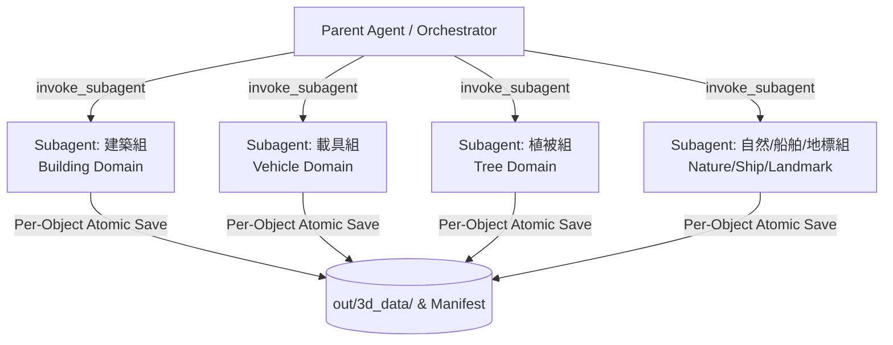

# Gemini Img-to-3D: In-Context Fine-Grained Pipeline

本 Skill 定義 **純 LLM In-Context 逐圖精細 3D 重建與多領域 Subagent 平行管線**。
適用於從目標照片提取深度語意、構建高還原度幾何多面體物件、並行排程以及即時原子化儲存之完整標準作業程序。

---

## 0. 核心設計原則與美學標準

### 0.1 美術風格：Abeto 賽璐璐動畫美學
- **清晰幾何剪影**：拒絕模糊軟爛網格，全面採用幾何多面體（多角稜柱、錐台、角錐、圓柱、圓台、半球/橢球、圓環、楔形、正多面體等）裝配構成。
- **色彩分區明確**：嚴格拆分 7 區色彩（屋頂/樹冠、主體/立面/車身、底座/底盤/樹幹、點綴飾條/車燈、金屬/暗部、鍍鉻/高光、冷調深藍玻璃）。

### 0.2 生成架構：Sakura Crossing 宣告式語意建模
- **每張照片獨立特徵化**：基於照片垂直切片（24-slice profile）、輪廓斜率、實體度、灰度梯度與對稱性獨立推理幾何參數。
- **絕無千篇一律的死板模板**：每張圖獨立計算各部件尺寸與裝配位置，風格獨一無二。

---

## 1. 物件領域平行化 (Domain-Sharded Subagents)

為避免單一對話 Context 膨脹並加速批量生產，採用 **領域切片平行化（Domain Sharding）**，透過 `invoke_subagent` 啟動專屬領域 Subagent：



### 1.1 四大領域 Subagent 專責劃分

| 領域 Subagent | 處理物件分類 | 核心幾何特徵與防呆重點 |
|---|---|---|
| 🤖 **Subagent-Building** | `building/mass`, `building/bld_*` | 區分平頂商辦（女兒牆/排氣管/逃生梯）、尖頂教堂（八角鐘樓/飛扶壁）、三角山牆木屋（斜頂山牆/煙囪）、東方寶塔（飛簷錐台/寶剎）、古典圓頂（柱列/半球穹頂）。 |
| 🤖 **Subagent-Vehicle** | `vehicle/bike`, `car`, `truck`, `train`, `motor` | 腳踏車細鋼管菱形車架（上管/下管/立管/後叉/前叉細圓柱）與圓環輪組；汽車/火車車身烤漆與**深藍透明玻璃（glassHex）嚴格分離**。 |
| 🤖 **Subagent-Tree** | `tree/canopy`, `tree/cf_*`, `tree/sp_*`, `tree/sh_*` | 針葉樹（多層交錯旋轉錐台輪生裙，**絕非立方體**）、闊葉神木（板根基座 + 十二面體雲團）、盆栽（陶盆 + 扭曲主幹 + 雲葉盤）、矮灌木。 |
| 🤖 **Subagent-Nature** | `rock/*`, `ship/*`, `landmark/*` | 巨岩（斷面與節理多面體）、船舶（船艏楔形/艦橋窗帶/煙囪）、地標設施（桁架結構/發光天線）。 |

### 1.2 Subagent 60% 上下文水位熔斷與重啟續行機制 (60% Threshold Circuit Breaker & Restart)

為徹底杜絕因長對話導致 Token 耗盡、超載崩潰或響應衰退，**強制執行 60% 上下文水位熔斷機制**：

1. **水位監控（Usage Watermark）**：
   - 當 Subagent 處理累計達 **Context Window 的 60%**（約每完成 30~40 筆 In-Context 詳細物件時），必須主動觸發「優雅暫停與交接（Graceful Hand-off）」。
2. **即時落盤確保零遺失（Atomic Flush）**：
   - 確保當前已完成的最後一個物件之 `model.json`、`features.json`、`metadata.json`、`model.obj` 全數落地。
   - 同步更新 `out/3d_database.json` 與 `tools/ai3d/parts_manifest.json`。
3. **交接回報（Handoff Report）**：
   - Subagent 向 Parent Agent 回報當前進度摘要（例如：「*Subagent-Building: 已完成 35/178 件，最後完成 key: `building/mass_35`，觸發 60% 額度熔斷交接*」）並結束該對話。
4. **乾淨重啟接續（Clean Restart & Resume）**：
   - Parent Agent 接收交接訊號後，立即啟動一個**全新的 Subagent**（Context 100% 清空重置）。
   - 全新 Subagent 透過斷點協定（§2.3）自動跳過已完成的 35 件，無縫接續處理第 36 件，直至該領域全數完工。

### 1.3 剩餘額度動態切換網路搜索擴充模式 (Dynamic Web Search Expansion on Remaining Quota)

當 Subagent 處理完該領域所分配之現有照片後，若 Context 仍有充裕額度（未達 60% 熔斷閾值），**強制自動切換為網路搜索擴充模式**繼續執行：

1. **對應類別精準檢索（Targeted Query）**：
   - Subagent 依自身專責領域（如建築、載具、樹木、自然/地標），針對資料庫中覆蓋率較低或具代表性之細項（例如：特定針闊葉樹種、歷史教堂尖塔、特殊工程車輛、貨櫃輪船等），使用精準物件名稱進行網路圖片檢索。
2. **雙軌授權分類與存放分流（Dual-Corpus Licence Routing）**：
   - 🟢 **CC0 / Public Domain 圖檔（出貨級）**：
     - 存入正式出貨庫存路徑：`tools/ai3d/photos/<family>/<subpart>/<image_name>`。
     - 登記於正式 `photo_manifest.json`，可用於遊戲本體發布。
   - 🟡 **非 CC0 / 具版權 / 未確認授權圖檔（研究參考級）**：
     - 存入受限研究庫存路徑：`C:\Users\user\Documents\study\ai3d_restricted\photos\<family>\<subpart>\<image_name>`。
     - 於帳本標註 `restricted: true` / `shipping: false`，僅供本機研究、對照台預覽與模型訓練驗證，不直接打包進出貨發行版。
3. **照片下載建檔與立即執行 Img-to-3D**：
   - 記錄來源資訊（`source_url`, `license`, `creator`, `query`）。
   - 下載完畢後立即對新圖片進行 In-Context 深度特徵推理與多面體 3D 幾何建模。
   - 執行 §2 逐件原子化落盤存檔（分別寫入對應之 `out/3d_data/`），持續擴充 3D 零件庫直至達到 60% 水位交接。

---

## 2. 逐件原子化儲存與斷點續傳機制 (Per-Object Atomic Save & Resume)

為防止 LLM 處理途中因達到 Token 限制或對話中斷導致進度遺失，**必須執行逐件原子化即時落盤（Per-Object Atomic Persistence）**。

### 2.1 單一物件產出規範
每當一個物件分析與幾何生成完成，必須立即將下列檔案寫入磁碟：
- `out/3d_data/<family>/<subpart>/<object_id>/model.json`（包含 parts 零件列表與完整三角面 meshData）
- `out/3d_data/<family>/<subpart>/<object_id>/features.json`（特徵辨識、對稱性、色彩色票、零件清單）
- `out/3d_data/<family>/<subpart>/<object_id>/metadata.json`（來源照片、生成版本 v4、包圍盒尺寸、三角形數）
- `out/3d_data/<family>/<subpart>/<object_id>/model.obj`（標準 Wavefront OBJ 幾何檔）

### 2.2 帳本與資料庫即時更新
- 即時更新 `out/3d_database.json` 索引項目。
- 即時登記 `tools/ai3d/parts_manifest.json` 來源帳。
- 記錄至檢查點狀態檔（`tools/ai3d/harvest_state.json`）。

### 2.3 斷點續傳協定 (Resume Protocol)
任何 Subagent 或批次重啟時：
1. 讀取 `out/3d_database.json` 與目標照片清單。
2. 檢查目標資料夾是否已有合法的 `model.json` 與 `features.json`。
3. 若已完成且版本符合 `v4`，直接**略過（Skip）**，從下一筆未完成的照片開始執行。

---

## 3. 多面體幾何基本體語彙 (Polyhedral Primitive Vocabulary)

幾何構裝必須使用以下多面體基本體，嚴禁退回單純立方體：

| 基本體類型 (`p.type`) | 參數結構 | 典型應用場景 |
|---|---|---|
| `box` | `dimensions: [w, h, d]` | 建築量體基座、貨櫃、招牌板、陽台底板 |
| `polygonal_prism` | `radius, height, sides` (3~16) | 六角/八角塔身、立柱迴廊、水塔支架 |
| `frustum_pyramid` | `radii: [topR, botR], height, sides` | 寶塔飛簷、針葉樹輪生裙、古典柱頭、花盆 |
| `pyramid` / `cone` | `radii: [0, botR] / radius, height, sides` | 教堂尖塔、寶剎塔尖、松樹頂梢、圓錐頂 |
| `cylinder` | `radius: [topR, botR] / r, height, sides` | 鋼管車架、輪軸、煙囪、樹幹、纜線管柱 |
| `conical_frustum` | `radii: [topR, botR], height, sides` | 漸縮樹幹、錐形桶身、輪圈內凹輪廓 |
| `hemisphere_dome` | `radii: [rx, ry, rz]` | 萬神殿圓頂、天文台穹頂、雷達罩 |
| `ellipsoid_sphere` | `radii: [rx, ry, rz]` | 闊葉樹雲冠、灌木叢、巨岩鼓包 |
| `torus_ring` | `radius, tube` | 腳踏車/車輛輪胎、管道法蘭環、救生圈 |
| `dodecahedron_polyhedron` | `radius` | 巨岩崩落塊、結晶節理、多面樹冠瓣 |
| `icosahedron_polyhedron` | `radius` | 粗糙天然礦石、有機群落特徵塊 |
| `wedge` | `dimensions: [w, h, d]` | 斜坡雙面山牆、船艏破浪楔、擋風導流罩 |

---

## 4. 色彩萃取與玻璃分離紀律

每個物件必須萃取並定義 7 區色彩，且於 `features.json` 與 `model.json` 中嚴格遵守：

```json
{
  "colors": {
    "roofHex": 12885915,
    "facadeHex": 16711422,
    "baseHex": 14474460,
    "accentHex": 3891402,
    "glassHex": 1976635,
    "darkHex": 2829100,
    "brightHex": 16711421
  }
}
```

- 🧊 **玻璃色隔離防線**：汽車擋風玻璃、側窗、船艦艦橋窗帶、建築幕牆一律使用深藍冷調色票（如 `0x1e293b`, `0x2c3e50`, `0x38bdf8`, `0x0f172a`），**絕不可與車身烤漆（facadeHex）混為一談**。

---

## 5. 離線稽核與回歸驗證防線

所有產出完成後，必須通過全套專案離線稽核：

```bash
# 1. 採集與入庫帳本稽核 (190 項全綠)
node tools/ai3d/audit_auto_intake.mjs

# 2. 零件對照台資料庫報告驗收 (0 缺件、0 孤兒)
node tools/parts_review.mjs --report

# 3. 街廓佈局與幾何信任階梯稽核 (265 項全綠)
node tools/audit_siteplan.mjs

# 4. 地標型錄與外廓稽核 (68 項全綠)
node tools/audit_beacons.mjs

# 5. 前端模組與 GLSL 語法稽核 (230 項全綠)
node tools/audit_client_syntax.mjs

# 6. 核心平衡不變式回歸驗證 (全數通過)
npm run bal
```
