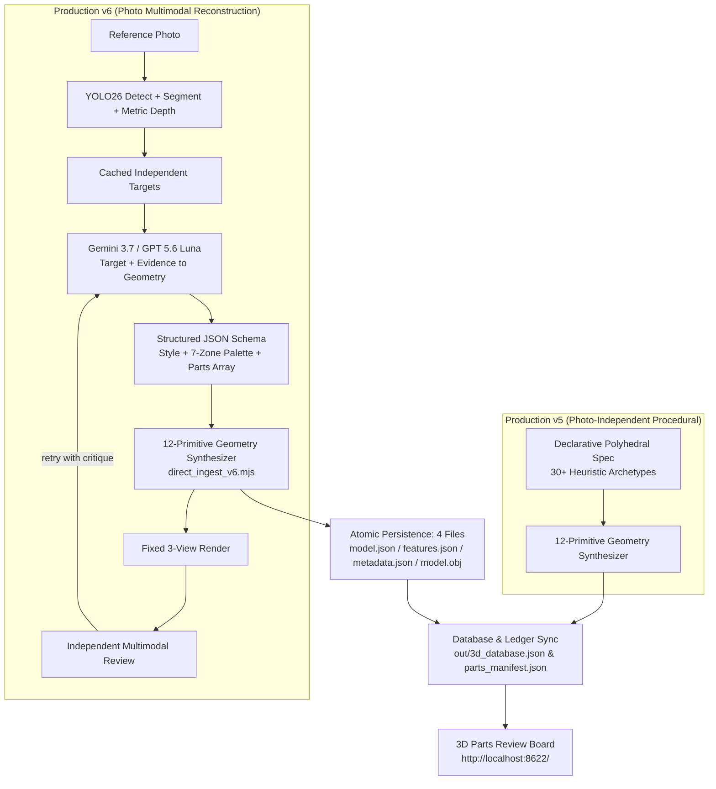

# LLM Img-to-3D: Versioned Polyhedral Reconstruction Pipeline

This skill owns the orchestration and artifact contract for the versioned photo-to-declarative-polyhedron pipeline used by the parts review board and runtime catalog. It does not duplicate family modeling, runtime shading, placement, mobile admission, motion, or visual-inspection methods owned by the routed skills below.

Retired and merged into this file (2026-09-06): `photo-to-3d-pipeline` (routed photo-to-part execution procedure) and `photo-to-prop-forge` (static part-vocabulary contract). Their unique operational rules are preserved in Appendix A below; do not resurrect the old skill names.

**v5 and v6 are both production sources.** v6 supersedes v5 only when both records represent the same source target and consumer slot. Keep both records in the database and review board; resolve precedence only when building a runtime selection. Legacy v1 is runtime-eligible only for rocks and conifers.

Player-controlled mecha are out of scope by default. Do not read, regenerate, or modify `public/js/forge/**` for this workflow. Building units and NPCs are separate consumers and may be processed only when the request names them.

Native functional buildings are also outside image-to-3D production. Temples, churches, hospitals, schools, stations, and museums must retain their project-native procedural generators because their gameplay-readable silhouettes and semantic collision profiles are part of the world contract. The shared exclusion policy is `public/js/nativeFunctionalBuildings.js`; import it in ingestion/catalog tools and never copy the category list into a second seam. Reference photos for these categories may remain as art study material, but must not enter the production runtime catalog.

## Required skill routing (single-owner, no overlap)

Load this skill first, then load only the skill that owns the current stage. Do not copy its rules into this file or reimplement its seam.

| Stage or family | Required skill | Ownership boundary |
|---|---|---|
| Buildings, vehicles, ships, appliances, street furniture | `generator-table-catalog` | Family axes, frontage convention, derived hardware, joints, batching choice |
| Trees, rocks, cloth, thin organic structures, weathering | `procedural-object-detail` | Deterministic detail, connected members, canopy/rock silhouette and surface variation |
| NPC/creature animation after geometry acceptance | `character-and-creature-motion` | Weight-vector animation, directed traffic motion, crowds, faces, damping |
| Packed textureless surfaces after catalog batching | `procedural-surface-shaders` | Per-vertex surface ABI and master surface shader; never geometry or PBR authoring |
| Applying accepted objects to districts | `scene-seams-and-light` | Build order, ground seating, district policy, perceptual and geometric seams |
| Mobile runtime admission | `mobile-webgl-interaction` | Memory admission, cooperative construction, device tiers and context recovery |
| Final visual and geometric closure | `headless-3d-inspection` | Fixed three-view captures, explicit stepping, raycasts and GPU measurements |

The routed skill is authoritative for its domain. This skill owns only target discovery, YOLO26 evidence, category delegation, LLM reconstruction, independent similarity review/retry, version/review-ledger reconciliation, atomic artifacts, and handoff into those domain seams.

---

## 0. Core Aesthetic & Technical Foundations

### 0.1 Art Style: Abeto Cel-Shaded Anime Aesthetic (messenger.abeto.co)
- **Crisp Polyhedral Silhouette**: Eliminate organic/mushy meshes. All models are assembled exclusively from discrete polyhedral primitives (Prisms, Frustums, Cones, Cylinders, Domes, Rings, Polyhedra, Wedges, Boxes).
- **Stepped Lighting & Cool Hue Shift**: Lighting is stepped into 2–4 flat discrete bands. Shadows shift hue toward cool blue/violet (`#1e293b` / `#2c3e50`) rather than desaturated darkness.
- **7-Zone Strict Color Palette Partitioning**: Every object strictly partitions its palette into 7 semantic zones (`roofHex`, `facadeHex`, `baseHex`, `accentHex`, `glassHex`, `darkHex`, `brightHex`).
- **Material Glazing Isolation**: Window glass, windscreens, and curtain walls strictly use cool translucent/navy tones (`glassHex`). Glazing must never be merged with facade wall paint or vehicle chassis base paint.
- **Zero Image Texture Dependency**: No external raster textures are used. Signage, labels, license plates, and road markings are rendered procedurally or via runtime Canvas2D textures.

### 0.2 Generation Architecture: Declarative Polyhedral Assembly
- **Pure-Data Declarative Schema**: Outputs a clean JSON array of structured primitive parts (specifying `type`, `dimensions` / `radii`, `pos`, `rot`, and `colorKey`).
- **Ground Seating Invariant**: The geometric pivot anchor and rotation center must sit strictly at the ground-contact base `[0, 0, 0]` (`y = 0` represents ground level).
- **Real-World Metric Scale**: Architecture, vehicles, and vegetation dimensions use real-world meters (m), strictly calibrated with the global `SOLDIER_H` (1.8m) scale system.

### 0.3 Bilateral Symmetry & Mirroring Protocol for High-Symmetry Typologies
- **High-Symmetry Object Classes**: Typologies exhibiting strong intrinsic symmetry—notably **Architecture** (buildings, high-rises, pavilions, colonnades, towers), **Vehicles / Transportation** (cars, trucks, buses, trains, aircraft), and **Marine Vessels** (ships, hulls, boats, naval craft).
- **Single-View Occlusion Infilling via Mirroring**: Reference photographs typically capture a single monocular perspective (e.g., three-quarter front, side, or top-down view), leaving the opposing lateral side occluded. For high-symmetry categories, unseen features on the opposite side **MUST be populated and completed using a bilateral mirroring method** (axial reflection across the central symmetry axis, e.g., reflecting `pos: [x, y, z]` to `[-x, y, z]` with corresponding rotational alignment `rot: [rx, -ry, -rz]`).
- **Paired Feature Coverage**: Symmetrically paired elements—including wheels, wheel wells, headlights/taillights, side mirrors, doors, side windows, flank balconies, roof eaves, colonnade wings, side panels, and propulsion pods—must be fully mirrored to guarantee 360-degree geometric completeness and prevent single-sided "flatback" or lopsided meshes.
- **Selective Functional Asymmetry**: Asymmetric accessories (e.g., vehicle snorkel, asymmetrical crane arm, driver-side steering wheel, unique commercial signage) should only remain one-sided when semantically intended, while the base chassis and structural envelope maintain strict bilateral mirroring.

---

## 1. Production Versions and Runtime Precedence



| Comparison Aspect | Production v5 (Photo-Independent) | Production v6 (Gemini 3.7 / GPT 5.6 Luna Photo-Reconstruction) |
|---|---|---|
| **Core Engine** | Pure declarative polyhedral templates & procedural synthesis | **YOLO26 evidence + Gemini 3.7 / GPT 5.6 Luna geometry + independent multimodal review** |
| **Photo Relation** | **None** (independent standalone polyhedral models, `imgs: []`, `image: null`) | **Strict 1:1 / multi-target photo reconstruction** with persistent evidence cache |
| **Morphological Reasoning** | 30 static polyhedral archetypes | **First-principles semantic decomposition; accurately reconstructs arbitrary non-standard topologies** |
| **Dependencies** | Zero external dependencies (pure Node.js) | **Zero npm dependencies; Python Ultralytics/OpenCV/NumPy/Pillow for mandatory YOLO26 evidence; Node native `node:https` for LLM calls** |
| **Color Extraction** | Canonical 7-zone palette heuristics | **LLM semantic isolation** (isolates foreground object, rejects background clouds, separates glazing) |
| **Throughput & Speed** | Instant declarative synthesis | **Cached YOLO26 preprocessing plus bounded generate/render/review retries** |
| **Version Management** | `version: 5, verStr: 'v5'`; retained and runtime-eligible | `version: 6, verStr: 'v6'`; retained and runtime-eligible |

### 1.1 Selection is separate from persistence

v5 objects are standalone procedural/declarative polyhedral models with no photo relationship. v6 objects are photo-derived reconstructions.
Both v5 and v6 records coexist in the database and review board.

Canonical target identity:
- For v6 (photo-derived): `canonicalTarget = ${family}/${subpart}|${primaryImageId}|${consumerSlot}`
- For v5 (photo-independent): `canonicalTarget = ${family}/${subpart}|${key}|${consumerSlot}`

- Never prefer a higher version over a human verdict. Only `status === 'ok'` is eligible.
- Legacy v1 is eligible only when `family === 'rock'` or when the tree role is explicitly `conifer`. Broadleaf canopy, snag, building, beacon, vehicle, and NPC v1 records are excluded even if an old board state says `ok`.
- Resolve this once in the catalog/intake seam. Renderers and scene builders consume the resolved roster and must not reimplement version precedence.

---

## 2. End-to-End Execution Workflow

### Mandatory gate sequence

Run these gates in order. A later gate must not infer or silently replace a missing earlier artifact.

1. **Reconcile review intent by stable target identity.** Build `family/subpart|source stem|consumer slot`; review-key hashes are not identity and may drift after reruns. `purge` means remove the source image, every derived crop/mask/depth/model artifact, DB/manifest rows, and the review item. `archive` is not purge: preserve its source and tombstone. `regen` means replace the failed v6 output but keep the source.
2. **Compute and cache real YOLO26 evidence before any LLM call.** Run `yolo26n.pt`, `yolo26n-seg.pt`, and `yolo26n-depth.pt`. Persist detection rows, instance masks, raw float32 metric depth, a depth preview, per-target crops, and `schemaVersion: 2` feature JSON. Skip this gate only when that complete cache validates; older YOLO11/YOLOv8 or Sobel-derived files are invalid.
3. **Split qualifying instances.** For every detected/segmented instance whose semantic class matches the requested family, create a separate target and stable `stem~index` id. Never merge two qualifying vehicles, boats, trees, or other requested objects into one reconstruction. If the pretrained label space has no matching class, keep one full-frame target instead of inventing class evidence.
4. **Delegate exactly one subagent per category.** Give each agent exclusive ownership of one family, the list of stable targets, YOLO26 feature paths, the routed skill, retry limit, and output namespace. Agents share the repository, so they must not edit the common pipeline or revert other agents. The parent owns deletion, catalog reconciliation, cross-family audits, and runtime application.
5. **Reconstruct one target per LLM call.** Include its crop and persisted YOLO26 evidence. If a prior visual review failed, include that review's concrete corrections. The LLM must not re-segment the full source or substitute a neighboring instance.
6. **Build and render before judging.** Synthesize the actual geometry, then render fixed front-three-quarter, side, and rear views. A separate multimodal LLM call compares the original target to those rendered views. The generation call's self-score is diagnostic only and cannot pass the gate.
7. **Retry with critique.** A pass requires reviewer verdict `pass`, score at least 75, and no hard defect from the quality contract below. Feed critique and corrections into the next generation call. After the configured retry limit, retain the old approved runtime object or fail closed; never persist the rejected candidate as eligible.
8. **Persist and reconcile atomically.** Write YOLO26 evidence, model files, preview, review record, DB row, and manifest row. Replace older rows by stable identity, not hash. Clear the old `regen` verdict only after the new candidate passes the automated review; it remains unapproved until human review says `ok`.
9. **Apply only approved output.** Resolve v6-over-v5 duplicate precedence once in the catalog. Invoke the placement, surface, motion, mobile, and inspection skills only after the object passes human review. Re-run their audits; do not change authoritative collision or gameplay geometry for a visual replacement.

### Hard geometry quality contract

- Roof ridges, eaves, wheel axes, tires, panels, fins, and every other directional part must have the correct orientation, width, thickness, diameter, and relative scale.
- Glass doors, windows, curtain walls, windscreens, side glass, lamps, and mirrors are explicit parts. Glass always uses `glassHex` and remains distinct from the structural mass.
- Structural parts meet at named joints or shared boundaries. No visible gaps, floating parts, see-through voids, or paper-thin backs; no excessive overlap. Surface-mounted detail clears its support by only 0.02–0.05 m.
- Symmetric buildings, vehicles, and vessels use bilateral mirroring to complete unseen sides and backs, followed by deliberate adjustment for functional asymmetry. A single-view shell is a hard failure.
- Bicycle frames, racks, railings, masts, branches, trunks, forks, stays, axles, and other thin members must be present, meet their intended endpoints, remain inside their assembly envelope, and never protrude accidentally.
- Ground contact is `y = 0`, dimensions are real-world metres relative to `SOLDIER_H = 1.8`, and purely visual reconstruction must not alter authoritative colliders.

### Canonical commands

```powershell
# Build only missing/invalid YOLO26 evidence for one category.
& .\.venv\Scripts\python.exe tools\ai3d\yolo_depth_segment.py --family building --review-status regen

# Regenerate only v6 entries whose human verdict is regen.
node tools\ai3d\direct_ingest_v6.mjs --family building --review-status regen --python .\.venv\Scripts\python.exe

# Validate the orchestration and independent review contract.
node tools\ai3d\audit_llm_img3d_v6.mjs
```

### Step 1: Environment & API Key Configuration
Set the API key in the environment (zero extra npm packages, strictly adhering to rule A2):
```powershell
# Windows PowerShell
$env:GEMINI_API_KEY="your-api-key"

# Windows Command Prompt
set GEMINI_API_KEY=your-api-key
```

### Step 2: Photo Discovery & Path Normalization
The pipeline automatically scans `.jpg`, `.jpeg`, `.png`, and `.webp` images across dual corpora:
1. **Public / Primary Corpus**: `C:\Users\user\Documents\steel_vs_swarm\tools\ai3d\photos\<family>\<subpart>\`
2. **Restricted / Study Corpus**: `C:\Users\user\Documents\study\ai3d_restricted\photos\<family>\<subpart>\`

Path classification rules:
- `family`: Top-level folder (`building`, `tree`, `vehicle`, `ship`, `rock`, `landmark`)
- `subpart`: Sub-level folder (e.g. `mass`, `canopy`, `car`, `hull`, `facet`)
- `stem`: Base filename (excluding file extension)

### Step 3: Multimodal Vision Understanding & Structured Output
`tools/ai3d/direct_ingest_v6.mjs` encodes images to Base64 and issues a native `node:https` request with a strict `responseSchema`:

```javascript
// System Prompt Invariants
const GEMINI_SYSTEM_PROMPT = `You are an expert 3D polyhedral geometric reconstruction engineer. Analyze the reference photograph, precisely identify object morphology, proportions, structural components, and color distribution, then describe the 3D geometry as a declarative list of polyhedral parts.
1. Every part MUST specify pos [x, y, z] with y = 0 as the ground-contact base plane.
2. Assembly parts must interface precisely without unwanted interpenetration or disjoint gaps.
3. High-Symmetry Typologies & Bilateral Mirroring: For symmetrical object classes (architecture, vehicles, ships, etc.), the unobserved/opposite side features MUST be generated using bilateral reflection/mirroring across the central symmetry axis (e.g., X or Z axis). Ensure symmetrically paired components (wheels, side mirrors, doors, paired windows, wings, headlights/taillights) are fully populated on both sides.
4. Do NOT mistake background sky, clouds, or ground shadows for object geometry.
5. Window/windshield glass MUST be strictly assigned to glassHex.
6. All dimensions must use real-world meters (m).`;
```

Structured JSON Response Format:
```json
{
  "style": "Modern High-Rise Residential",
  "symmetryMode": "symmetric",
  "colors": {
    "roofHex": 8355711,
    "facadeHex": 9804166,
    "baseHex": 3426654,
    "accentHex": 15105314,
    "glassHex": 1976635,
    "darkHex": 2899536,
    "brightHex": 15527149
  },
  "parts": [
    {
      "name": "ground_podium",
      "type": "box",
      "dimensions": [15.3, 4.2, 13.1],
      "pos": [0, 2.1, 0],
      "rot": [0, 0, 0],
      "colorKey": "baseHex"
    },
    {
      "name": "main_tower",
      "type": "box",
      "dimensions": [12.0, 25.8, 10.5],
      "pos": [0, 17.1, 0],
      "rot": [0, 0, 0],
      "colorKey": "facadeHex"
    }
  ]
}
```

### Step 4: 12-Primitive Polyhedral Geometry Synthesis
The geometry synthesis engine converts the declarative `parts` array into full 3D meshes using 12 procedural generators:

| Primitive (`type`) | Parameter Schema | Application Examples |
|---|---|---|
| `box` | `dimensions: [w, h, d]` | Building base masses, cargo containers, signboards, balcony slabs |
| `polygonal_prism` | `radius, height, sides` (3~16) | Hexagonal/octagonal towers, colonnades, storage tank legs |
| `frustum_pyramid` | `radii: [topR, botR], height, sides` | Pagoda flared eaves, temple roofs, conifer foliage skirts, column capitals |
| `pyramid` | `radii: [0, botR], height, sides` | Steeples, pine tree apex, pyramid caps |
| `cylinder` | `radii: [topR, botR], height, sides` | Steel trusses, exhaust stacks, tree trunks, utility poles, axles |
| `conical_frustum` | `radii: [topR, botR], height, sides` | Tapered tree trunks, conical tanks, recessed wheel rims |
| `cone` | `radii: [0, botR], height, sides` | Conical roof caps, radome noses |
| `hemisphere_dome` | `radii: [rx, ry, rz]` | Observatory domes, pantheon rotundas, radar radomes |
| `ellipsoid_sphere` | `radii: [rx, ry, rz]` | Broadleaf canopy clouds, shrub masses, rock mounds |
| `torus_ring` | `radius, tube` | Tires, pipe flanges, lifebuoys, ring handrails |
| `dodecahedron_polyhedron` | `radius` | Boulder fragments, crystalline nodes, faceted foliage clusters |
| `icosahedron_polyhedron` | `radius` | Rough mineral rocks, organic clusters, coral boulders |
| `wedge` | `dimensions: [w, h, d]` | Gabled roofs, dormers, ship bow wedges, windshield cowlings |

### Step 5: Evidence and model persistence
For every completed object, the validated YOLO26 cache remains under `out/yolo_*` and the following model files are atomically written into `out/3d_data/<family>/<subpart>/<targetId>_v6/`:
1. **`model.json`**: Hierarchical parts array, local transforms, bounding envelope, 7-zone color table, and triangulated vertex/normal/uv/face buffers.
2. **`features.json`**: Computer vision semantic tags, style classification, symmetry mode, 7-color hex values, and primitive type breakdown.
3. **`metadata.json`**: Provenance metadata (`id`, `key: <family>/<subpart>_<stem>_<hash>_v6`, `version: 6`, `verStr: 'v6'`, `method: 'gemini_v6'`, source image path, creation timestamp, bounds, triangle count).
4. **`model.obj`**: Standard Wavefront OBJ 3D mesh format with explicit vertices (`v`), normals (`vn`), texture coordinates (`vt`), and faces (`f`).

The fixed three-view preview is stored under `out/review_previews/`. `metadata.json` records the independent reviewer score, verdict, critique, correction list, preview path, and target-specific YOLO26 evidence. Missing evidence or a failed verdict makes the model ineligible for persistence and runtime selection.

### Step 6: Database, Ledger, and Runtime Roster Synchronization
1. **`out/3d_database.json`**:
   - Reads existing database items, retains all v5 records, and merges newly generated v6 objects.
   - All v6 objects carry a distinct `_v6` suffix on `id` and `key` to prevent key collisions.
2. **`tools/ai3d/parts_manifest.json`**:
   - Registers entries under `method: 'gemini_v6'`, `version: 6`, `verStr: 'v6'`, `keys: ['<partKey>_v6']`.
3. **Resume Protocol**:
   - On startup, inspect the full YOLO26 evidence cache and `out/3d_database.json`. Skip a valid completed v6 target to avoid redundant model calls, except when `--review-status regen` explicitly selects that stable target.
4. **Runtime roster**:
   - Join database records to `tools/parts_review/state.json`; only human-approved `ok` records enter the candidate set.
   - Apply the v1 whitelist and v6-over-duplicate-v5 rule from §1.1.
   - Emit or expose one resolved roster for all runtime consumers. Do not mutate the review ledger to express runtime precedence.

---

## 3. CLI Operation Manual

### 3.1 Running v6 Geometric Reconstruction

```bash
# 1. Standard execution (processes all photos using default Gemini 3.7 / GPT 5.6 Luna)
node tools/ai3d/direct_ingest_v6.mjs

# 2. Limit number of items (quick test or small batch)
node tools/ai3d/direct_ingest_v6.mjs --limit 5

# 3. Filter by asset family
node tools/ai3d/direct_ingest_v6.mjs --family building
node tools/ai3d/direct_ingest_v6.mjs --family tree
node tools/ai3d/direct_ingest_v6.mjs --family vehicle

# 4. Filter by specific subpart
node tools/ai3d/direct_ingest_v6.mjs --only building/mass

# 5. Explicitly override model (e.g. Gemini 3.7 Pro or GPT 5.6 Luna)
node tools/ai3d/direct_ingest_v6.mjs --model gemini-3.7-pro --limit 10
node tools/ai3d/direct_ingest_v6.mjs --model gpt-5.6-luna --limit 10
```

### 3.2 WebGL Parts Review Board

```bash
# Launch the local review server (Default Port 8622)
npm run parts
# or
node tools/parts_review.mjs
```

Open browser at: 👉 **`http://localhost:8622/`**

**Review Board Capabilities**:
1. **Version Filtering**: Switch the top filter dropdown to **`v6`**, **`v5`**, legacy **`v1`**, or **`all`**. A filter is a review view, not runtime precedence.
2. **Dual-Viewport Comparison**: Left viewport renders real-time 3D polyhedral models; right viewport renders baseline versions or reference photos.
3. **Envelope & Wireframe Inspection**: Toggle bounding cylinders and mesh wireframes to inspect spatial clearances and collider alignment.
4. **Metadata & Palette Card**: Inspect 7-Zone hex colors, triangle counts, bounding extents `[w, h, d]`, and vertex buffers.

### 3.3 Offline Audits & Verification Battery

```bash
# 1. CLI Report (filter v6 objects)
node tools/parts_review.mjs --report --version v6

# 2. Provenance ledger & version management audit (Section XIII verification)
node tools/ai3d/audit_auto_intake.mjs

# 3. Client syntax & shader validation (230 invariant checks)
node tools/audit_client_syntax.mjs
```

---

## 4. Resilience & Error Handling Principles

In compliance with Core Principle 6 ("Graceful Degradation, No Exceptions; Better Omit Than Corrupt"):
1. **API High Demand & Rate Limiting (503 / 429)**: When an API encounters temporary load spikes or timeouts, the script logs a warning and skips the image, **never aborting the entire batch**.
2. **Corrupt Images or Unsupported Formats**: Unreadable files are skipped with a warning log.
3. **Empty Output or Filter Rejection**: If an LLM response cannot be parsed or yields zero parts, the item is skipped gracefully, ensuring database integrity remains uncorrupted.

---

## Appendix A. Legacy photo-route discipline (merged from `photo-to-3d-pipeline` + `photo-to-prop-forge`, retired 2026-09-06)

This appendix preserves the pre-v6 operational knowledge that the v5/v6 gates above do not restate. It is normative for photo-sourced static parts (rock/tree/building/landmark) and advisory elsewhere.

### A.1 Route decision (shape, not family)

| Route | What the photo becomes | When |
|---|---|---|
| **0 - drawing to hull** (`method: plan_hull`) | Orthographic drawing contours extruded and intersected (visual hull is solved, not generated) | Whenever a measured drawing exists; a drawing states depth, a photo guesses it |
| **A - img to three.js** (`method: llm_parts`) | Read the photo, write pure-data primitive rows into the existing part table; zero GPU, zero binary | Regular / man-made geometry a primitive can honestly express |
| **B - local Blender** (`method: sf3d`) | Run the photo through SF3D on the 12GB box, normalise headless, ship a named node in `assets/models/parts/{family}.glb` | Organic / irregular geometry a primitive cannot express |
| **neither** (`method: procedural`) | Nothing stays; small/ordinary vegetation keeps procedural parts; mechs never enter this pipeline | Budget or rig reasons |

Route A is the cheapest complete proof of photo to part vocabulary to audits to review board (no Python, GPU, or GLB). Ship Route A members first when a family is blocked on weights or quota.

### A.2 Photo sourcing (CC0 hard gate)

- Hard-code `license=cc0` (public domain included); **CC-BY is also rejected** - a baked-in part carries no attribution slot. Record `{source_url, license, creator, retrieved_at}` per download; manifest paths are relative POSIX.
- Fetcher: `node tools/ai3d/fetch_photos.mjs --plan | --family <f> --limit <n> | --part <family/subpart> | --review`. Catalog order is priority order. Bytes are sniffed (JPEG/PNG/WebP headers only), never trusted by extension.
- Throttling is per host (Wikimedia `upload.wikimedia.org` 429 with `Retry-After: 600` after ~30 downloads); a 429 is network state, never booked to the manifest.
- Query wording is the largest quality lever: ask for a **named single subject** (`glacial erratic`, `solitary oak tree meadow`), never a scene. Selection standard: single subject, clean, well lit, short side >= 1024.
- After matting, `screen_mattes.py` enforces: largest connected alpha component >= 0.70 of subject area; mean subject luma >= 35 unless shadow fraction < 0.70. Thresholds carry a shape assumption - re-scope per family, never tighten on two samples. Measure the matte, not the photo; area share, not blob count.

### A.3 Route B operation (SF3D workhorse)

```bash
# 1. matte (CPU ok)
.venv/Scripts/python matte_photos.py <family> <subpart>
# 2. generate (batch; batching is ~free)
.venv/Scripts/python vendor/stable-fast-3d/run.py <matte dir>/*.png --texture-resolution 512 --remesh_option triangle --target_vertex_count 520
# 3. solidity prefilter (statistics, not content)
node tools/ai3d/mesh_stats.mjs <sf3d out dir>
# 4. normalise (Blender headless; field separator is `|` since `:` collides with drive letters)
blender --background --python tools/ai3d/normalize_parts.py -- --base public/assets/models/parts/<family>.glb --out public/assets/models/parts/<family>.glb --node "<node>=<src.glb>|<r>x<hy>|<tri cap>|<ry>|<dy>"
# 5. intake gate
node tools/ai3d/intake_parts.mjs
```

- Use SF3D remesh; never hard-decimate raw output in Blender (50k-tri shell tears into speckle holes at 50:1). Blender only centres, scales, trims.
- `mesh_stats` filters shells (blocky fill >= ~0.34, shells/flakes < 0.15); the human-eye pass on the top few is mandatory (~1/15 usable from a CC0 pool).
- **Origin on the mating face**: canopy origin at canopy base, roof cap at eaves, talus at ground. Centring is correct only for stacked stone (consumer `p:` offsets assume it); use `dy` to ground. Same-source nodes get a yaw so duplicates do not read as one stone twice. Always `--base` when appending (re-running a node causes bit drift).

### A.4 Consumption seams (pick by consumer, do not invent a fourth)

- `beacons.js KIND_PARTS` (declarative): `{ g: ['lib', 'rock/facet_a', ['ico', 1.15]], ... }` - `g[2]` fuse is the offline extent bound.
- `biomes.js VEG_DEFS / GIANT_DEFS` (declarative): `{ g: ico(5), lib: 'tree/canopy_a5', y: 12, key: 'foliage' }` - the `??` fallback MUST stay.
- `biomes.js MEGALITHS / synthMegalith` (imperative): `const g = megaGeo('rock/mega_a') ?? primitive()` with `.clone()` (bakeContactAO writes vertex colours in place).
- Layout math reads the fuse, never library geometry (load-dependent radii diverge clients silently). Swapping geometry consumes zero extra `rnd()` on both paths. `beacons.js` front half stays THREE-free for offline verification.

### A.5 Triangle budget and provenance

- Family gets two gates: per part <= heaviest whole unit today, AND sum(library parts) per unit <= `kind_factor` x current unit total. `kind_tris` is a measured snapshot - re-measure after any consumer table change. Measurement = headless browser executing the consumer source with real three, summing `index.count/3`. A missing measurement is a legitimate stop; never hand-write a cap.
- One row per generation job in `tools/ai3d/parts_manifest.json` (`method`, `consumer`, `rev`, `imgs[]`, `gen`, `post`, `baseline.rev` for Route A). Size ladders are one row with `keys: [...]`. Never copy derivable numbers (extents, tri counts) into it. No record = listed as unrecorded on the review board.

### A.6 Acceptance battery

```bash
node tools/ai3d/intake_parts.mjs
node tools/audit_object_joints.mjs --seeds 8
node tools/audit_beacons.mjs && node tools/audit_beacons.mjs --break-extent
node tools/audit_siteplan.mjs && node tools/audit_siteplan.mjs --break-shy
node tools/shot_scene.mjs --venue taroko   # --ink=0 / --grade=0 / --post=0 isolate a layer
npm test && npm run bal
```

Reverse verification is the acceptance: if `--break-extent` / `--break-shy` / an oversized node does not turn red, the round proved nothing. Build the board "original" pane and cache it before `loadPartLibs()` or both panes silently draw the same geometry.
