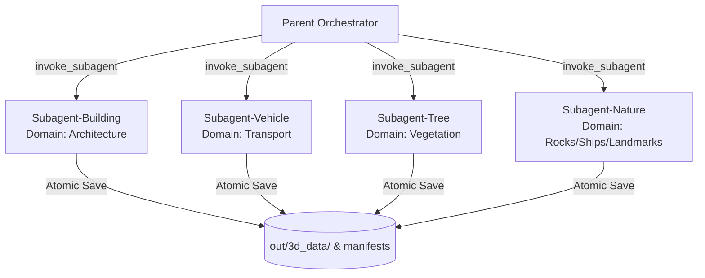

# LLM Img-to-3D: In-Context Polyhedral Reconstruction Pipeline

Defines the pure LLM in-context semantic image-to-3D reconstruction, domain-sharded subagent execution protocol, vision disambiguation filters, and atomic persistence pipeline. Transforms single-view reference images into clean, stylized polyhedral 3D assemblies matching the Abeto anime aesthetic and Sakura Crossing procedural generation architecture.

---

## 0. Core Aesthetic & Technical Foundations

### 0.1 Art Style: Abeto Cel-Shaded Anime Aesthetic (messenger.abeto.co)
- **Crisp Geometric Silhouette**: Eliminate organic/mushy meshes. Construct all geometry through discrete polyhedral primitives (prisms, frustums, cones, cylinders, domes, rings, polyhedra, wedges).
- **Quantised Lighting & Shadow Hue Shift**: Light is stepped into 2-4 flat discrete bands. Shadows shift hue toward cool blue/violet (`#1e293b` / `#2c3e50`) rather than desaturated darkness.
- **7-Zone Strict Color Separation**: Strict partition across 7 palette zones (`roofHex`, `facadeHex`, `baseHex`, `accentHex`, `glassHex`, `darkHex`, `brightHex`).
- **Glass & Chrome Isolation**: Windows, windscreens, and curtain walls strictly use cool translucent/navy tones (`glassHex`). Never merge window glass with facade paint or vehicle chassis.
- **Zero Image Texture Dependency**: All surface markings, decals, and signage are generated procedurally or via runtime Canvas2D.

### 0.2 Generation Engine: Sakura Crossing Declarative Assembly (Kenton-GMI/sakura-crossing)
- **In-Context Semantic Decomposition**: Perform 24-slice vertical profile analysis, silhouette slope estimation, solidity calculation, grayscale gradient mapping, and axial symmetry detection directly from input images.
- **Pure-Data Declarative Schema**: Output geometry as structured JSON primitive part arrays (`type`, `dimensions` / `radii`, `pos`, `rot`, `colorKey`).
- **Parametric Uniqueness**: Compute exact bounding envelopes and relative part ratios per individual image; no generic/uniform templates.
- **Ground Seating & Zero Keep-Out Invariants**: Pivot anchor must sit at ground-contact base `[0, 0, 0]`. Ensure parts observe `TERRAIN_DROP` and collider clearance rules.

---

## 1. Domain-Sharded Subagent Execution Architecture

Distribute batch reconstruction across 4 domain-specific subagents via `invoke_subagent` to maintain context cleanliness and throughput:



### 1.1 Subagent Domain Responsibilities & Specialized Dispatch

| Domain Subagent | Target Object Keys | Core Morphology & Disambiguation Focus |
|---|---|---|
| 🤖 **Subagent-Building** | `building/mass`, `building/bld_*` | Commercial flat roofs (parapets, HVAC chillers, escape ladders), gothic spires, gabled chalets, oriental pagodas (flared multi-tier eaves), classical rotundas. **Novel morphologies must be synthesized from first principles rather than boxed.** |
| 🤖 **Subagent-Vehicle** | `vehicle/bike`, `car`, `truck`, `train`, `motor` | Bicycles (diamond tubular skeleton + torus wheels; sub-pixel thin member recovery); motor vehicles (**strict separation of `glassHex` windscreens/side windows from chassis**). |
| 🤖 **Subagent-Tree** | `tree/canopy`, `tree/cf_*`, `tree/sp_*`, `tree/sh_*` | **STRICT BAN ON CUBE CANOPIES**. Species-specific grammars: Conifer (stacked alternating frustums), Broadleaf (dodecahedron clusters + buttress roots), Bamboo (segmented culms + fan wedges), Shrubs (grounded ellipsoids). **Sky/cloud background rejection**. |
| 🤖 **Subagent-Nature** | `rock/*`, `ship/*`, `landmark/*` | Megaliths (faceted fracture planes), ships (wedge bow + superstructure + mast poles; glazing isolation), landmarks (truss frameworks, beacon towers). |

### 1.2 60% Context Window Circuit Breaker & Hand-off Protocol

To prevent context exhaustion and quality degradation, subagents enforce an automated 60% watermark hand-off:

1. **Watermark Monitoring**:
   - At ~60% context capacity (~30-40 fully reconstructed objects), trigger a graceful pause.
2. **Atomic Disk Flush**:
   - Guarantee the last completed object's `model.json`, `features.json`, `metadata.json`, and `model.obj` are fully written to disk.
   - Sync `out/3d_database.json` and `tools/ai3d/parts_manifest.json`.
3. **Handoff Signal**:
   - Subagent reports summary back to Parent: `"Subagent-Building: Completed 35/178 items, last key: building/mass_35, triggering 60% context circuit-breaker"` and terminates.
4. **Clean Restart & Resume**:
   - Parent Orchestrator launches a fresh Subagent instance (0% context).
   - The new subagent executes Resume Protocol (§2.3), skips all completed items, and continues seamlessly from item 36.

### 1.3 Dynamic Web Search Expansion on Remaining Quota

If existing input photos are exhausted before reaching the 60% context limit, subagents automatically transition to Web Search Expansion Mode:

1. **Targeted Semantic Query**:
   - Search for under-represented categories in the database (e.g. specific cedar varieties, historical spire styles, heavy machinery, cargo vessels).
2. **Dual-Corpus License Routing**:
   - 🟢 **CC0 / Public Domain (Shipping Grade)**:
     - Save to: `tools/ai3d/photos/<family>/<subpart>/<image_name>`.
     - Register in `photo_manifest.json` for shipping bundle inclusion.
   - 🟡 **Restricted / Unverified (Study Grade)**:
     - Save to: `C:\Users\user\Documents\study\ai3d_restricted\photos\<family>\<subpart>\<image_name>`.
     - Flag in ledger as `restricted: true` / `shipping: false` (local study & review only).
3. **Immediate Reconstruction & Intake**:
   - Log provenance (`source_url`, `license`, `creator`, `query`).
   - Run In-Context Img-to-3D reconstruction, output atomic artifacts (§2), and update indices.

---

## 2. Per-Object Atomic Persistence & Resume Protocol

### 2.1 Artifact Directory Structure
For every reconstructed object, write atomically into `out/3d_data/<family>/<subpart>/<object_id>/`:
- `model.json`: Hierarchical parts list, primitive specs, local transforms, and triangulated mesh data.
- `features.json`: Semantic tags, profile measurements, symmetry axes, 7-color hex table.
- `metadata.json`: Source image path/URL, generator version (`v5`), bounding box `[w, h, d]`, triangle count.
- `model.obj`: Standard Wavefront OBJ 3D geometry file.

### 2.2 Ledger & Database Synchronization
- Append/update entry in `out/3d_database.json`.
- Register record in `tools/ai3d/parts_manifest.json`.
- Write status into checkpoint file `tools/ai3d/harvest_state.json`.

### 2.3 Resume Protocol
On initialization or restart:
1. Load target photo list and `out/3d_database.json`.
2. Inspect target directory for valid `model.json` and `features.json`.
3. If valid and `version === "v5"`, **skip** item and proceed to next incomplete entry.

---

## 3. Polyhedral Primitive Geometry Vocabulary & Assembly Grammars

All assemblies must be composed exclusively of the following declarative primitives:

| Primitive (`p.type`) | Parameter Schema | Application Examples |
|---|---|---|
| `box` | `dimensions: [w, h, d]` | Building base masses, cargo containers, signboards, balcony slabs |
| `polygonal_prism` | `radius, height, sides` (3-16) | Hexagonal/octagonal towers, colonnades, tank supports |
| `frustum_pyramid` | `radii: [topR, botR], height, sides` | Pagoda eaves, conifer foliage skirts, column capitals, planters |
| `pyramid` / `cone` | `radii: [0, botR], height, sides` | Church steeples, spire tips, pine tree apex, conical caps |
| `cylinder` | `radii: [topR, botR] | radius, height, sides` | Steel bike tubes, wheel axles, chimneys, tree trunks, utility poles |
| `conical_frustum` | `radii: [topR, botR], height, sides` | Tapered tree trunks, conical vats, recessed wheel rims |
| `hemisphere_dome` | `radii: [rx, ry, rz]` | Observatory domes, pantheon rotundas, radar radomes |
| `ellipsoid_sphere` | `radii: [rx, ry, rz]` | Broadleaf canopy clouds, shrub clusters, rock humps |
| `torus_ring` | `radius, tube` | Bicycle / vehicle tires, pipe flanges, lifebuoys |
| `dodecahedron_polyhedron` | `radius` | Boulder fragments, crystalline joints, faceted foliage clusters |
| `icosahedron_polyhedron` | `radius` | Rough mineral rocks, organic clusters, coral boulders |
| `wedge` | `dimensions: [w, h, d]` | Gabled roofs, ship bow wedges, windshield cowlings, ramps |

---

### 3.1 Architectural Archetype Matching & Novel Topology Rule
Select geometry strictly matching target architectural morphology:
1. **Commercial Flat-Roof**: Base `box` + inset parapet `box` frame + rooftop HVAC `box` / chiller `cylinder` + emergency ladder `cylinder` array.
2. **Gothic / Alpine Church**: Nave `box` + pitched roof `wedge` + bell tower `polygonal_prism` (octagonal, 8 sides) + steeple `pyramid` (8 sides) + flying buttress `wedge` spans.
3. **Gabled Cottage / Chalet**: Lower floor `box` + upper overhang `box` + dual-slope gable `wedge` + chimney `box` / `cylinder`.
4. **Oriental Pagoda / Shrine**: Stepped base `box` + stacked alternating stories (`polygonal_prism`) + flared eaves (`frustum_pyramid` with `topR < botR` and outer lip flare) + finial spire (`cone` + stacked `torus_ring` rings).
5. **Classical Rotunda / Dome**: Stylobate disc (`cylinder`) + peristyle column array (radial `cylinder`s) + entablature ring (`cylinder` / `polygonal_prism`) + hemisphere dome (`hemisphere_dome`).
6. **Novel / Unprecedented Archetypes**: If the target building exhibits non-standard morphology (e.g. hyperbolic shell, folded plate, geodesic sphere, stepped ziggurat), **MUST NOT fallback to a simple box**. Synthesize a composite assembly from first principles by combining appropriate polyhedral primitives to match the true silhouette.

---

### 3.2 Botanical Canopy Grammars (Strict Ban on Generic Cubes)
Canopies must **NEVER** be approximated as a single `box`. Use tailored botanical primitive grammars:
1. **Conifers (Pine, Cedar, Fir, Cryptomeria)**:
   - Trunk: Tapered vertical `conical_frustum` or `cylinder` (`colorKey: "facadeHex"`).
   - Foliage: 4-8 vertically stacked `frustum_pyramid` (6-8 sides) with alternating azimuth rotations (`rot: [0, Math.PI / n, 0]`), terminating in an apex `pyramid` / `cone` (`colorKey: "roofHex"`).
2. **Broadleaf & Deciduous (Oak, Camphor, Cherry, Maple)**:
   - Trunk & Roots: Main trunk `cylinder` / `conical_frustum` + 3-5 radial buttress root `wedge` or angled `conical_frustum` anchors (`colorKey: "baseHex"`).
   - Canopy: Multi-lobed cluster of 5-12 interpenetrating `dodecahedron_polyhedron` or flattened `ellipsoid_sphere` nodes (`colorKey: "roofHex"`).
3. **Shrubs, Hedges & Boxwood**:
   - Hemispherical / rounded clusters using ground-truncated `ellipsoid_sphere` or low-poly `icosahedron_polyhedron` masses.
4. **Bamboo & Palms**:
   - Culms/Trunks: Segmented slender `cylinder` sections with intermediate node `torus_ring` joints.
   - Fronds/Foliage: Radial star/fan arrays of angled thin `wedge` or extruded flat `polygonal_prism` leaves.
5. **Bonsai & Potted Flora**:
   - Ceramic base pot: `frustum_pyramid` / `conical_frustum` (`colorKey: "baseHex"`).
   - Sinuous trunk: 3-5 linked, angled, and rotated `cylinder` segments.
   - Foliage: Distinct horizontal tabular cloud discs of `ellipsoid_sphere` or `dodecahedron_polyhedron`.

---

### 3.3 Micro-Skeleton & Thin-Feature Recovery Protocol
Delicate structural elements (bicycles, space-frame trusses, antennas, ship masts, railings) must be explicitly recovered and parameterized:
1. **Bicycles & Light Two-Wheelers**:
   - Frame Diamond: Distinct slender `cylinder` primitives (`radius: 0.015-0.025m`) for Top Tube, Down Tube, Seat Tube, Seat Stays, Chain Stays, and Front Fork.
   - Wheels: 2x `torus_ring` tires (`radius: 0.33m, tube: 0.025m`) + hub `cylinder`s.
   - Handlebars & Saddle: Transverse `cylinder` handlebar with angled grip segments + wedge/box saddle.
2. **Lattice Trusses & Antennas**:
   - Construct vertical chords with 3-4 corner `cylinder`s / `polygonal_prism`s braced with diagonal lattice cross-struts. Never consolidate into a solid prism.
3. **Maritime Masts & Deck Railings**:
   - Ship masts, radar arches, and cranes must be isolated as dedicated slender `cylinder` hierarchies standing upon the deck, with rigging points preserved.

---

## 4. Vision Disambiguation & Palette Discipline

### 4.1 Background / Sky / Cloud Hallucination Rejection Filter
When inferring geometry from single-view photographs:
- **Sky & Cloud Segregation**: White or pale blue upper regions must be cross-checked against background chromatic continuity. High-luminance, low-saturation regions with diffuse continuous gradients represent sky/cloud backgrounds - **NEVER reconstruct sky/clouds into foliage canopies or roof geometry**.
- **Silhouette Boundary Test**: Valid foliage and roof boundaries exhibit high local contrast, micro-occlusion step changes, or self-shadow contours. Continuous atmospheric gradients must be subtracted during feature isolation.
- **Horizon & Terrain Disambiguation**: Ground contact must be established at the true base plane (`y = 0`). Ground shadows and horizon hills must not be mistaken for base plinths.

### 4.2 Material Glazing vs Chassis/Hull Isolation
- **Vehicle Glazing Separation**: Windscreens, rear windows, side glass, and cabin glazing must NEVER inherit the vehicle chassis body color (`facadeHex`). They must be explicitly extracted and assigned to `glassHex` (cool deep navy/cyan tone: `0x1e293b`, `0x2c3e50`, `0x38bdf8`, `0x0f172a`).
- **Maritime Wheelhouses & Bridge Bands**: Ship observation bridges and porthole bands must be isolated into distinct `glassHex` strips embedded into the `facadeHex` superstructure.
- **Architectural Curtain Walls & Shopfronts**: Ground floor retail display windows and ribbon curtain glazing must be isolated as `glassHex` recessed surfaces.

---

### 4.3 7-Zone Color Palette Schema & Enforcement

Every object must extract and define exactly 7 discrete color hex values in `features.json` and `model.json`:

```json
{
  "colors": {
    "roofHex": 12885915,
    "facadeHex": 16711422,
    "baseHex": 14474460,
    "accentHex": 3891402,
    "glassHex": 1976635,
    "darkHex": 2829100,
    "brightHex": 16711421
  }
}
```

- `roofHex`: Roof surfaces, upper canopy foliage, primary vehicle top trims.
- `facadeHex`: Primary exterior walls, vehicle chassis base paint, main tree trunks.
- `baseHex`: Foundation plinths, undercarriages, root collars, planters, curbs.
- `accentHex`: Signage borders, headlight bezels, moldings, accent panels.
- `glassHex` (**Strict Isolation**): Windscreens, side windows, bridge observation bands, curtain wall glazing (`0x1e293b`, `0x2c3e50`, `0x38bdf8`, `0x0f172a`). Never assign `facadeHex` to glass.
- `darkHex`: Mechanical underbodies, exhaust mufflers, tires, deep recessed shadow voids, structural grates.
- `brightHex`: Chrome trims, illuminated lamps, white road markings, specular highlight bands.

---

## 5. Offline Audit & Verification Battery

All generated assets and ledger updates must pass the repository's offline verification suite with 100% green status:

```bash
# 1. Intake and provenance ledger audit (190 invariant checks)
node tools/ai3d/audit_auto_intake.mjs

# 2. Parts review database validation (0 missing, 0 orphaned parts)
node tools/parts_review.mjs --report

# 3. Urban siteplan and geometry trust hierarchy audit (265 invariant checks)
node tools/audit_siteplan.mjs

# 4. Landmark catalog and envelope verification (68 invariant checks)
node tools/audit_beacons.mjs

# 5. Client syntax & GLSL shader validation (230 invariant checks)
node tools/audit_client_syntax.mjs

# 6. Core gameplay balance invariants
npm run bal
```
