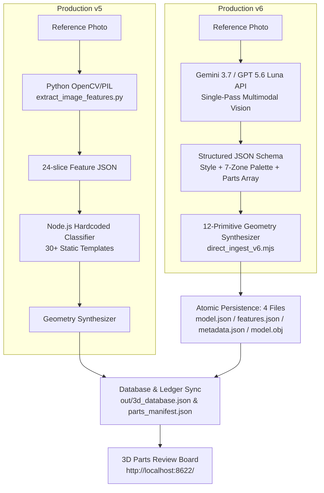

# LLM Img-to-3D: Versioned Polyhedral Reconstruction Pipeline

This document defines the versioned photo-to-declarative-polyhedron pipeline used by the parts review board and runtime catalog.

**v5 and v6 are both production sources.** v6 supersedes v5 only when both records represent the same source target and consumer slot. Keep both records in the database and review board; resolve precedence only when building a runtime selection. Legacy v1 is runtime-eligible only for rocks and conifers.

---

## 0. Core Aesthetic & Technical Foundations

### 0.1 Art Style: Abeto Cel-Shaded Anime Aesthetic (messenger.abeto.co)
- **Crisp Polyhedral Silhouette**: Eliminate organic/mushy meshes. All models are assembled exclusively from discrete polyhedral primitives (Prisms, Frustums, Cones, Cylinders, Domes, Rings, Polyhedra, Wedges, Boxes).
- **Stepped Lighting & Cool Hue Shift**: Lighting is stepped into 2–4 flat discrete bands. Shadows shift hue toward cool blue/violet (`#1e293b` / `#2c3e50`) rather than desaturated darkness.
- **7-Zone Strict Color Palette Partitioning**: Every object strictly partitions its palette into 7 semantic zones (`roofHex`, `facadeHex`, `baseHex`, `accentHex`, `glassHex`, `darkHex`, `brightHex`).
- **Material Glazing Isolation**: Window glass, windscreens, and curtain walls strictly use cool translucent/navy tones (`glassHex`). Glazing must never be merged with facade wall paint or vehicle chassis base paint.
- **Zero Image Texture Dependency**: No external raster textures are used. Signage, labels, license plates, and road markings are rendered procedurally or via runtime Canvas2D textures.

### 0.2 Generation Architecture: Declarative Polyhedral Assembly
- **Pure-Data Declarative Schema**: Outputs a clean JSON array of structured primitive parts (specifying `type`, `dimensions` / `radii`, `pos`, `rot`, and `colorKey`).
- **Ground Seating Invariant**: The geometric pivot anchor and rotation center must sit strictly at the ground-contact base `[0, 0, 0]` (`y = 0` represents ground level).
- **Real-World Metric Scale**: Architecture, vehicles, and vegetation dimensions use real-world meters (m), strictly calibrated with the global `SOLDIER_H` (1.8m) scale system.

### 0.3 Bilateral Symmetry & Mirroring Protocol for High-Symmetry Typologies
- **High-Symmetry Object Classes**: Typologies exhibiting strong intrinsic symmetry—notably **Architecture** (buildings, high-rises, pavilions, colonnades, towers), **Vehicles / Transportation** (cars, trucks, buses, trains, aircraft), and **Marine Vessels** (ships, hulls, boats, naval craft).
- **Single-View Occlusion Infilling via Mirroring**: Reference photographs typically capture a single monocular perspective (e.g., three-quarter front, side, or top-down view), leaving the opposing lateral side occluded. For high-symmetry categories, unseen features on the opposite side **MUST be populated and completed using a bilateral mirroring method** (axial reflection across the central symmetry axis, e.g., reflecting `pos: [x, y, z]` to `[-x, y, z]` with corresponding rotational alignment `rot: [rx, -ry, -rz]`).
- **Paired Feature Coverage**: Symmetrically paired elements—including wheels, wheel wells, headlights/taillights, side mirrors, doors, side windows, flank balconies, roof eaves, colonnade wings, side panels, and propulsion pods—must be fully mirrored to guarantee 360-degree geometric completeness and prevent single-sided "flatback" or lopsided meshes.
- **Selective Functional Asymmetry**: Asymmetric accessories (e.g., vehicle snorkel, asymmetrical crane arm, driver-side steering wheel, unique commercial signage) should only remain one-sided when semantically intended, while the base chassis and structural envelope maintain strict bilateral mirroring.

---

## 1. Production Versions and Runtime Precedence



| Comparison Aspect | Production v5 | Production v6 (Gemini 3.7 / GPT 5.6 Luna) |
|---|---|---|
| **Core Engine** | Python OpenCV slice metrics + heuristic classifier | **Gemini 3.7 / GPT 5.6 Luna multimodal vision understanding** |
| **Morphological Reasoning** | Restricted to 30 static templates (unmatched shapes degrade to generic boxes) | **First-principles semantic decomposition; accurately reconstructs arbitrary non-standard topologies** |
| **Dependencies** | Requires Python 3.11/3.13 venv + OpenCV + NumPy + PIL | **Zero npm / Zero Python dependencies** (pure Node.js native `node:https`) |
| **Color Extraction** | K-Means clustering (often polluted by sky/ground shadows) | **LLM semantic isolation** (isolates foreground object, rejects background clouds, separates glazing) |
| **Throughput & Speed** | Dual-stage pipeline (~3.5s feature extraction + 0.5s synthesis) | **Single-pass end-to-end (API round-trip ~3–5s)** |
| **Version Management** | `version: 5, verStr: 'v5'`; retained and runtime-eligible | `version: 6, verStr: 'v6'`; retained, and preferred only for a duplicate target |

### 1.1 Selection is separate from persistence

Do not delete, archive, or rewrite a v5 record merely because a v6 record exists. Persistence answers "what was produced and reviewed"; runtime selection answers "which approved record fills this slot".

Build a canonical duplicate identity from stable source and consumer semantics, never from array order:

```js
canonicalTarget = `${family}/${subpart}|${primaryImageId}|${consumerSlot}`;
```

- If an approved v6 and approved v5 share `canonicalTarget`, select v6.
- If only one approved production version exists, select it regardless of whether it is v5 or v6.
- Different photos, subparts, or consumer slots are variants, not duplicates; keep both.
- Never prefer a higher version over a human verdict. Only `status === 'ok'` is eligible.
- Legacy v1 is eligible only when `family === 'rock'` or when the tree role is explicitly `conifer`. Broadleaf canopy, snag, building, beacon, vehicle, and NPC v1 records are excluded even if an old board state says `ok`.
- Resolve this once in the catalog/intake seam. Renderers and scene builders consume the resolved roster and must not reimplement version precedence.

---

## 2. End-to-End Execution Workflow

### Step 1: Environment & API Key Configuration
Set the API key in the environment (zero extra npm packages, strictly adhering to rule A2):
```powershell
# Windows PowerShell
$env:GEMINI_API_KEY="your-api-key"

# Windows Command Prompt
set GEMINI_API_KEY=your-api-key
```

### Step 2: Photo Discovery & Path Normalization
The pipeline automatically scans `.jpg`, `.jpeg`, `.png`, and `.webp` images across dual corpora:
1. **Public / Primary Corpus**: `C:\Users\user\Documents\steel_vs_swarm\tools\ai3d\photos\<family>\<subpart>\`
2. **Restricted / Study Corpus**: `C:\Users\user\Documents\study\ai3d_restricted\photos\<family>\<subpart>\`

Path classification rules:
- `family`: Top-level folder (`building`, `tree`, `vehicle`, `ship`, `rock`, `landmark`)
- `subpart`: Sub-level folder (e.g. `mass`, `canopy`, `car`, `hull`, `facet`)
- `stem`: Base filename (excluding file extension)

### Step 3: Multimodal Vision Understanding & Structured Output
`tools/ai3d/direct_ingest_v6.mjs` encodes images to Base64 and issues a native `node:https` request with a strict `responseSchema`:

```javascript
// System Prompt Invariants
const GEMINI_SYSTEM_PROMPT = `You are an expert 3D polyhedral geometric reconstruction engineer. Analyze the reference photograph, precisely identify object morphology, proportions, structural components, and color distribution, then describe the 3D geometry as a declarative list of polyhedral parts.
1. Every part MUST specify pos [x, y, z] with y = 0 as the ground-contact base plane.
2. Assembly parts must interface precisely without unwanted interpenetration or disjoint gaps.
3. High-Symmetry Typologies & Bilateral Mirroring: For symmetrical object classes (architecture, vehicles, ships, etc.), the unobserved/opposite side features MUST be generated using bilateral reflection/mirroring across the central symmetry axis (e.g., X or Z axis). Ensure symmetrically paired components (wheels, side mirrors, doors, paired windows, wings, headlights/taillights) are fully populated on both sides.
4. Do NOT mistake background sky, clouds, or ground shadows for object geometry.
5. Window/windshield glass MUST be strictly assigned to glassHex.
6. All dimensions must use real-world meters (m).`;
```

Structured JSON Response Format:
```json
{
  "style": "Modern High-Rise Residential",
  "symmetryMode": "symmetric",
  "colors": {
    "roofHex": 8355711,
    "facadeHex": 9804166,
    "baseHex": 3426654,
    "accentHex": 15105314,
    "glassHex": 1976635,
    "darkHex": 2899536,
    "brightHex": 15527149
  },
  "parts": [
    {
      "name": "ground_podium",
      "type": "box",
      "dimensions": [15.3, 4.2, 13.1],
      "pos": [0, 2.1, 0],
      "rot": [0, 0, 0],
      "colorKey": "baseHex"
    },
    {
      "name": "main_tower",
      "type": "box",
      "dimensions": [12.0, 25.8, 10.5],
      "pos": [0, 17.1, 0],
      "rot": [0, 0, 0],
      "colorKey": "facadeHex"
    }
  ]
}
```

### Step 4: 12-Primitive Polyhedral Geometry Synthesis
The geometry synthesis engine converts the declarative `parts` array into full 3D meshes using 12 procedural generators:

| Primitive (`type`) | Parameter Schema | Application Examples |
|---|---|---|
| `box` | `dimensions: [w, h, d]` | Building base masses, cargo containers, signboards, balcony slabs |
| `polygonal_prism` | `radius, height, sides` (3~16) | Hexagonal/octagonal towers, colonnades, storage tank legs |
| `frustum_pyramid` | `radii: [topR, botR], height, sides` | Pagoda flared eaves, temple roofs, conifer foliage skirts, column capitals |
| `pyramid` | `radii: [0, botR], height, sides` | Steeples, pine tree apex, pyramid caps |
| `cylinder` | `radii: [topR, botR], height, sides` | Steel trusses, exhaust stacks, tree trunks, utility poles, axles |
| `conical_frustum` | `radii: [topR, botR], height, sides` | Tapered tree trunks, conical tanks, recessed wheel rims |
| `cone` | `radii: [0, botR], height, sides` | Conical roof caps, radome noses |
| `hemisphere_dome` | `radii: [rx, ry, rz]` | Observatory domes, pantheon rotundas, radar radomes |
| `ellipsoid_sphere` | `radii: [rx, ry, rz]` | Broadleaf canopy clouds, shrub masses, rock mounds |
| `torus_ring` | `radius, tube` | Tires, pipe flanges, lifebuoys, ring handrails |
| `dodecahedron_polyhedron` | `radius` | Boulder fragments, crystalline nodes, faceted foliage clusters |
| `icosahedron_polyhedron` | `radius` | Rough mineral rocks, organic clusters, coral boulders |
| `wedge` | `dimensions: [w, h, d]` | Gabled roofs, dormers, ship bow wedges, windshield cowlings |

### Step 5: 4-File Atomic Disk Persistence
For every completed object, 4 discrete files are atomically written into `out/3d_data/<family>/<subpart>/<targetId>_v6/`:
1. **`model.json`**: Hierarchical parts array, local transforms, bounding envelope, 7-zone color table, and triangulated vertex/normal/uv/face buffers.
2. **`features.json`**: Computer vision semantic tags, style classification, symmetry mode, 7-color hex values, and primitive type breakdown.
3. **`metadata.json`**: Provenance metadata (`id`, `key: <family>/<subpart>_<stem>_<hash>_v6`, `version: 6`, `verStr: 'v6'`, `method: 'gemini_v6'`, source image path, creation timestamp, bounds, triangle count).
4. **`model.obj`**: Standard Wavefront OBJ 3D mesh format with explicit vertices (`v`), normals (`vn`), texture coordinates (`vt`), and faces (`f`).

### Step 6: Database, Ledger, and Runtime Roster Synchronization
1. **`out/3d_database.json`**:
   - Reads existing database items, retains all v5 records, and merges newly generated v6 objects.
   - All v6 objects carry a distinct `_v6` suffix on `id` and `key` to prevent key collisions.
2. **`tools/ai3d/parts_manifest.json`**:
   - Registers entries under `method: 'gemini_v6'`, `version: 6`, `verStr: 'v6'`, `keys: ['<partKey>_v6']`.
3. **Resume Protocol**:
   - On startup, inspects `out/3d_database.json`. If a photo already possesses a valid `version === 6` record, it is skipped immediately to avoid redundant API consumption.
4. **Runtime roster**:
   - Join database records to `tools/parts_review/state.json`; only human-approved `ok` records enter the candidate set.
   - Apply the v1 whitelist and v6-over-duplicate-v5 rule from §1.1.
   - Emit or expose one resolved roster for all runtime consumers. Do not mutate the review ledger to express runtime precedence.

---

## 3. CLI Operation Manual

### 3.1 Running v6 Geometric Reconstruction

```bash
# 1. Standard execution (processes all photos using default Gemini 3.7 / GPT 5.6 Luna)
node tools/ai3d/direct_ingest_v6.mjs

# 2. Limit number of items (quick test or small batch)
node tools/ai3d/direct_ingest_v6.mjs --limit 5

# 3. Filter by asset family
node tools/ai3d/direct_ingest_v6.mjs --family building
node tools/ai3d/direct_ingest_v6.mjs --family tree
node tools/ai3d/direct_ingest_v6.mjs --family vehicle

# 4. Filter by specific subpart
node tools/ai3d/direct_ingest_v6.mjs --only building/mass

# 5. Explicitly override model (e.g. Gemini 3.7 Pro or GPT 5.6 Luna)
node tools/ai3d/direct_ingest_v6.mjs --model gemini-3.7-pro --limit 10
node tools/ai3d/direct_ingest_v6.mjs --model gpt-5.6-luna --limit 10
```

### 3.2 WebGL Parts Review Board (3D 零件對照台)

```bash
# Launch the local review server (Default Port 8622)
npm run parts
# or
node tools/parts_review.mjs
```

Open browser at: 👉 **`http://localhost:8622/`**

**Review Board Capabilities**:
1. **Version Filtering**: Switch the top filter dropdown to **`v6`**, **`v5`**, legacy **`v1`**, or **`all`**. A filter is a review view, not runtime precedence.
2. **Dual-Viewport Comparison**: Left viewport renders real-time 3D polyhedral models; right viewport renders baseline versions or reference photos.
3. **Envelope & Wireframe Inspection**: Toggle bounding cylinders and mesh wireframes to inspect spatial clearances and collider alignment.
4. **Metadata & Palette Card**: Inspect 7-Zone hex colors, triangle counts, bounding extents `[w, h, d]`, and vertex buffers.

### 3.3 Offline Audits & Verification Battery

```bash
# 1. CLI Report (filter v6 objects)
node tools/parts_review.mjs --report --version v6

# 2. Provenance ledger & version management audit (Section XIII verification)
node tools/ai3d/audit_auto_intake.mjs

# 3. Client syntax & shader validation (230 invariant checks)
node tools/audit_client_syntax.mjs
```

---

## 4. Resilience & Error Handling Principles

In compliance with Core Principle 6 ("Graceful Degradation, No Exceptions; Better Omit Than Corrupt"):
1. **API High Demand & Rate Limiting (503 / 429)**: When an API encounters temporary load spikes or timeouts, the script logs a warning and skips the image, **never aborting the entire batch**.
2. **Corrupt Images or Unsupported Formats**: Unreadable files are skipped with a warning log.
3. **Empty Output or Filter Rejection**: If an LLM response cannot be parsed or yields zero parts, the item is skipped gracefully, ensuring database integrity remains uncorrupted.
