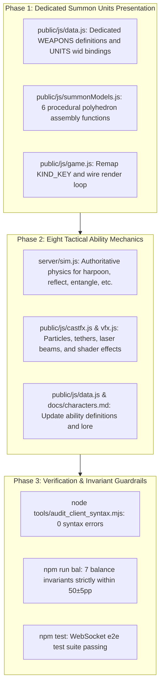

# Combat Skills and Autonomous Summon Units Overhaul Plan

> **Document Scope**: Architecture and implementation roadmap for:
> 1. Decoupling 6 hero autonomous summon units from generic NPC creep models (dedicated procedural polyhedron 3D geometry, distinctive visual liveries, and dedicated weapon definitions).
> 2. Integrating 8 high-tactical-interaction original combat ability mechanics (Kinetic Harpoon Tether, Reflective Polarized Aegis, Quantum Entanglement Link, Thermite Mine Cluster, Phase Shift, Holographic Decoy Beacon, Nanite Swarm Infestation, Singularity Implosion) to replace remaining generic/homogenized abilities across the mech roster.

---

## Part 1: Autonomous Summon Units Decoupling from NPC Creeps

### 1. Current State & Objectives
- **Current State**: Summon units have achieved autonomy at the AI & simulation logic level (`lane: null`, `summoned: true`, focus-fire target tracking via `lastHitTargetId`, scaling multipliers `scale = 1 + (lvl - 1) * 0.35`). However, at the presentation layer (rendering, 3D geometry, and weapons), they still share generic lane creep meshes (`creep:apc`, `creep:heli`, `creep:tank`, `creep:soldier`, `hero:drone`) and generic weapon IDs (`rgun`, `rocket`, `siege`).
- **Objectives**:
  1. Build dedicated procedural polyhedron 3D models (`summon:*`), removing all `creep:*` visual mappings.
  2. Implement distinctive faction/character livery palettes, motifs, and decorative geometry matching their respective summoner lores.
  3. Define dedicated weapon entries in `WEAPONS` with custom muzzle velocities, fire rates, beam/projectile VFX, and impact effects.
  4. Ensure zero regressions against the 7 core balance invariants (`npm run bal`) and e2e integration test battery (`npm test`).

### 2. Autonomous Units Design & Weapon Specifications

| Unit Key & Summoner | Role & Archetype | Dedicated Polyhedron 3D Geometry | Livery & Visual Palette | Dedicated Weapon & Ballistic Presentation |
|---|---|---|---|---|
| **`drone_wingman`** S-09 Prof. Dariush Farahzad ("The Poet") | Aerial autonomous escort drone | Scaled-down delta-canard configuration (inspired by Shahed-136), sharp faceted wings, dual-lens downward electro-optical seeker turret, micro phase-glow wingtips. | Ash-violet & ivory totem pattern (`0xc9b7e8`) with dark obsidian panel accents | **`wingman_beam` ("Elegy" Autonomous Micro-Beam Lance)**: Range 170m, high-frequency pulsed solid-state laser, purple coherent beam raycast (`0xd4afff`). |
| **`assault_rover`** M-06 Túlio Ferreira ("Carnival") | High-mobility ground assault rover | 6-wheeled high-clearance off-road chassis, exposed roll-cage and drive axles, roof-mounted acoustic bass-membrane radar housing, flexible trailing antenna pennant. | Rio Carnival sunburst gold & yellow (`0xf0c24a`) with tropical flame decals | **`rover_autocannon` ("Carnaval" Twin-Fragment Autocannon)**: Range 140m, high-rate twin-barrel burst, velocity 850m/s, golden tracer rounds (`0xffdf66`). |
| **`heli_squad`** S-01 Kateryna Shevchenko ("Queen Bee") | Heavy assault attack helicopter | Heavy coaxial twin-rotor gunship, streamlined aerodynamic fuselage, nose tuning-fork sensor mast, dual wingstub micro-rocket pods. | Ukrainian black-earth olive green (`0x4a5d4e`) bordered with conductor tailcoat gold trim (`0xdfca7a`) | **`squad_rocket` ("Fugue" Laser-Guided Cluster Micro-Rockets)**: Range 180m, rapid salvo, velocity 720m/s, pale blue musical harmonic trails (`0x9ecfff`). |
| **`main_battle_tank`** T-05 Shen Heming ("Crane") | Heavy breakthrough main battle tank | Shenyang Heavy Industries 7th-gen tracked chassis, biomimetic hydropneumatic suspension, low-profile faceted turret, crane-feather phased radar reflector. | Accord industrial titanium gray (`0x3d444d`) with high-contrast anti-slip coating and stenciled factory insignia | **`mbt_cannon` ("Sky Piercer" 130mm Smoothbore Penetrator)**: Range 160m, hypervelocity sabot penetrator, muzzle velocity 1650m/s, incandescence projectile with kinetic shockwave (`0xffebd2`). |
| **`veteran_squad`** T-11 Rafael Fuentes ("Old Cigar") | Elite powered-exoskeleton strike team | Heavy powered exoskeleton combat armor, left-arm deployable ballistic buckler shield, compact back-mounted cooling pack, monocular tactical visor. | Classic Cuban jungle blotch camo (`0x4b533e`) | **`veteran_hmg` ("Old Warrior" Custom 12.7mm AP Heavy Machine Gun)**: Range 150m, heavy acoustic thump, velocity 880m/s, tungsten armor-piercing sparks. |
| **`carnival_heli`** M-06 Túlio Ferreira ("Carnival") | Heavy aerial gunship squadron | Modified heavy gunship, single main rotor with tail rotor, heavily armored cockpit bathtub, external high-power funk PA speaker array, revolving rocket canister. | Tropical neon lime green (`0x3ad97a`) with blazing orange tiger striping (`0xff6b35`) | **`carnival_missile` ("Samba Heatwave" Air-to-Ground Incendiary Pod)**: Range 180m, high-velocity incendiary rockets, velocity 650m/s, trailing flame sparks. |

---

## Part 2: Eight High-Tactical Original Ability Mechanics

To eliminate the remaining generic/homogenized skills across the mech roster (generic dashes, generic stealth, generic EMPs, and generic stat buffs), 8 original skill mechanics are designed with high tactical depth:

### 1. Kinetic Harpoon Tether (`harpoon`)
- **Assigned Mech**: `s04` Soma Kashimura ("Kashi") [readjusted from s06 to strictly honor displacement-for-displacement invariant and preserve Maya's interceptor shield]
- **Target Replacement**: Replaces original dash mobility `Swift Dash` (`dash`) with dual-vector kinetic harpoon
- **Mechanics**:
  - Fires a high-tension electromagnetic alloy harpoon (range 45m).
  - **Hitting an enemy mech**: Drags the target directly in front of the caster, dealing armor-penetrating damage and inflicting a 1.0s stun.
  - **Hitting obstacles/terrain**: Rapidly pulls the caster toward the impact point, providing 3D verticality and evasive escape routes.

### 2. Reflective Polarized Aegis (`reflect`)
- **Assigned Mech**: `m07` Yolanda Ríos ("Boundary Stone")
- **Target Replacement**: Replaces passive projectile deletion `Impenetrable Dome` (`intercept`)
- **Mechanics**:
  - Deploys a 120° forward polarized reflective barrier for 3.0 seconds.
  - Incoming direct projectiles (machine-gun bullets, kinetic sabots, beam lasers) are **reflected back toward the aiming direction** at 60% damage.
  - Explosive shells and missiles are deflected away off-course.

### 3. Quantum Entanglement Link (`entangle`)
- **Assigned Mech**: `t12` Alesya Karpovich ("Firefly")
- **Target Replacement**: Replaces generic whole-map vision `Omniscience Scan` (`buff`+`recon`)
- **Mechanics**:
  - Fires a spectral resonance beam tethering up to 3 enemy units within a 15m radius for 6.0 seconds.
  - Any damage, armor reduction, slow, or burn inflicted on one tethered target is **replicated and transmitted to all linked targets at 40% efficiency**.

### 4. Thermite Mine Cluster (`thermite`)
- **Assigned Mech**: `s03` Lin Ling ("Leviathan")
- **Target Replacement**: Replaces generic close-range emergency blast
- **Mechanics**:
  - Disperses a fan of 6 magnetic thermite proximity mines during flyover or retreat, active for 12 seconds.
  - Triggered mines knock enemies airborne and create a 12m-diameter molten slag puddle burning for 5 seconds (continuous armor melt + 20% slow).

### 5. Phase Shift (`phaseshift`)
- **Assigned Mech**: `m08` Vidya Rathore ("Night Leopard")
- **Target Replacement**: Upgrades original dash mobility to hyper-dimensional Phase Dash (`phaseshift`, impulse `[28, 34, 40]`)
- **Mechanics**:
  - The mech bursts forward along aim direction with impulse `[28, 34, 40]` and enters a hyper-dimensional phase state for 1.8 seconds: completely invulnerable, ignores all collision boxes (can pass through buildings, trees, and enemy mechs), but cannot fire weapons.
  - Re-emerging emits an omnidirectional 6m shockwave knocking back nearby enemies and granting 100% critical chance on the next attack.

### 6. Holographic Decoy Beacon (`decoy_beacon`)
- **Assigned Mech**: `t04` Nadezhda Orlova ("Grey Goose") [readjusted from t02 to preserve Vera's dash mobility]
- **Target Replacement**: Replaces generic optical camouflage `Thermal Cloaking` (`stealth`)
- **Mechanics**:
  - Throws an active holographic emitter projecting 2 identical drone silhouettes that charge forward with realistic radar signatures.
  - Attracts enemy turret fire and missile guidance. When destroyed, each decoy releases a high-intensity flashbang blinding enemies within 14m for 1.5 seconds.

### 7. Nanite Swarm Infestation (`nanite`)
- **Assigned Mech**: `s05` Ha Seul-gi ("Overclock")
- **Target Replacement**: Replaces generic single-target blast
- **Mechanics**:
  - Launches a bio-mechanical nanite canister consuming 8% max HP and armor per second for 4.0 seconds.
  - If the host unit dies while infected, the swarm splits into 2 micro-swarms seeking out adjacent enemy targets within 15m.

### 8. Singularity Implosion (`singularity`)
- **Assigned Mech**: `s12` Emir Seitov ("Return") [readjusted from s10 under expanded displacement definition to replace dark moon enemy-pulling vortex]
- **Target Replacement**: Replaces original enemy displacement `Dark Moon Implosion` (`moon`, gravitational pull) with tactical singularity sphere
- **Mechanics**:
  - Projects a forward-traveling micro-singularity sphere (8m/s) pulling in enemies and capturing flying projectiles within an 18m vortex.
  - After 3.0 seconds, the sphere collapses into a gravitational implosion, dealing exponential shockwave damage scaling with captured projectiles and entities.

---

## Part 3: Architecture & Module Dependency Roadmap

---

## Part 4: Verification & Acceptance Gates

1. **Visual Independence**:
   - All 6 summon units use standalone geometry and custom liveries without falling back to `creep:*` meshes.
2. **Authoritative Resolution**:
   - All 8 new mechanics are computed strictly within `server/sim.js`; the client remains purely presentational.
3. **Offline Balance Invariants**:
   - `npm run bal` passes with all 7 invariant checks green; robot/morph/drone win rates remain balanced within 45%~55%.
4. **Automated Test Battery**:
   - `npm test` runs end-to-end and exits with zero failures.
