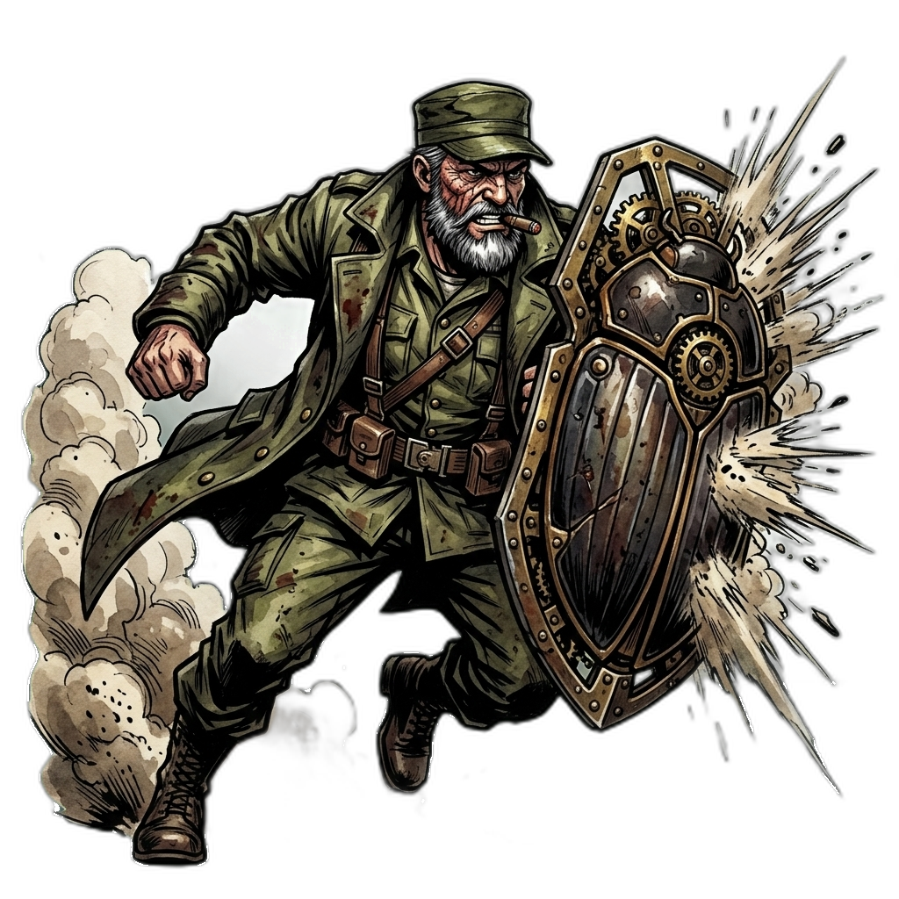

# 招式–立繪相似度檢核表

> 定義（2026-09-21 使用者定案）：每名角色一攻招一守招，不再分大小招。
> 攻招＝ult 槽（無護盾時施展），守招＝skill 槽（護盾模式中施展，見 `abilHoldSlot`）。
> 立繪檔名一律 `{id}_skill_atk.png`（攻招圖）／`{id}_skill_def.png`（守招圖），由 `data.js abilArtFile` 單一縫推導。
> 2026-09-21 交換：m07 守招 ⇆ t11 守招（立繪跟招式走；m07 補足位移類，解近戰約束違規）。
> 2026-09-22 重繪：全數 11 項吻合度低／中之招式立繪重繪完成，吻合度全數提升至高（64／64 達標）。淘汰之舊圖全數移至 `backup/assets/characters/`。
>
> 吻合度：高＝立繪直接描繪招式內容；中＝姿態／意象相符但缺關鍵要素；低＝內容錯位。
> 全數角色招式立繪（64／64）均已達標「高」。以下為 2026-09-22 完成重繪處理之紀錄表。

| # | 角色 | 招式 | 吻合度 | 圖片 | 需改進點 / 處理紀錄 |
|---|---|---|---|---|---|
| 1 | s10 白噪音 | 守招・始祖・天塹巨翼（持盾衝撞） | 高（已重繪） |  | 2026-09-22 已重繪為持巨盾突進＋磁力充盈特效，背景透明，舊圖已備份 |
| 2 | s01 蜂后 | 守招・賦格・天籟共鳴（護盾共鳴） | 高（已重繪） |  | 2026-09-22 已加入同心圓金色音波共鳴護盾力場罩籠罩全機群，背景透明，舊圖已備份 |
| 3 | s02 鐵匠 | 攻招・天工・萬象焚熔（全軍修復） | 高（已重繪） |  | 2026-09-22 已加入烈焰鍛造飛舞光幕籠罩多台友機與機甲護盾修復剪影，背景透明，舊圖已備份 |
| 4 | s08 聖燭 | 攻招・暮鐘・萬物復甦（全軍修復） | 高（已重繪） |  | 2026-09-22 已融入巨型暮鐘半透明共振幻影與鐘波修復紋，背景透明，舊圖已備份 |
| 5 | s09 獵場主 | 守招・逐風・靈步躍遷（加速＋大跳躍） | 高（已重繪） |  | 2026-09-22 已改為騰空躍起加速動態、風圈與高速殘影，背景透明，舊圖已備份 |
| 6 | t01 冬將軍 | 守招・霜狼・北境重盾（持盾突進） | 高（已重繪） |  | 2026-09-22 已加上霜狼巨盾持盾突進與暴風雪破浪冰晶，背景透明，舊圖已備份 |
| 7 | t06 小川 | 攻招・通天・身外化影（分身協同） | 高（已重繪） |  | 2026-09-22 已加入兩具化身水墨剪影協同飛身揮斬墨弧，背景透明，舊圖已備份 |
| 8 | t12 螢火 | 守招・同調・螢火護生（護盾減傷） | 高（已重繪） |  | 2026-09-22 已加入全罩式能量防護光罩與螢火微粒環繞視覺，背景透明，舊圖已備份 |
| 9 | m01 渡鴉 | 守招・狂湧・血月之庇（持盾衝撞） | 高（已重繪） |  | 2026-09-22 已改為持重盾衝撞＋血月受擊吸收回充特效，背景透明，舊圖已備份 |
| 10 | m06 嘉年華 | 守招・狂歡・花車浮游（擴盾＋加速） | 高（已重繪） |  | 2026-09-22 已加入地面擴張之蜂巢六角護盾範圍圈與推進氣流，背景透明，舊圖已備份 |
| 11 | m07 界碑 | 守招・拒止・百戰心訣（盾撞擊退） | 高（已重繪） |  | 2026-09-22 已改為持鞘翅甲盾霸道衝撞＋擊退震波衝擊特效，背景透明，舊圖已備份 |
