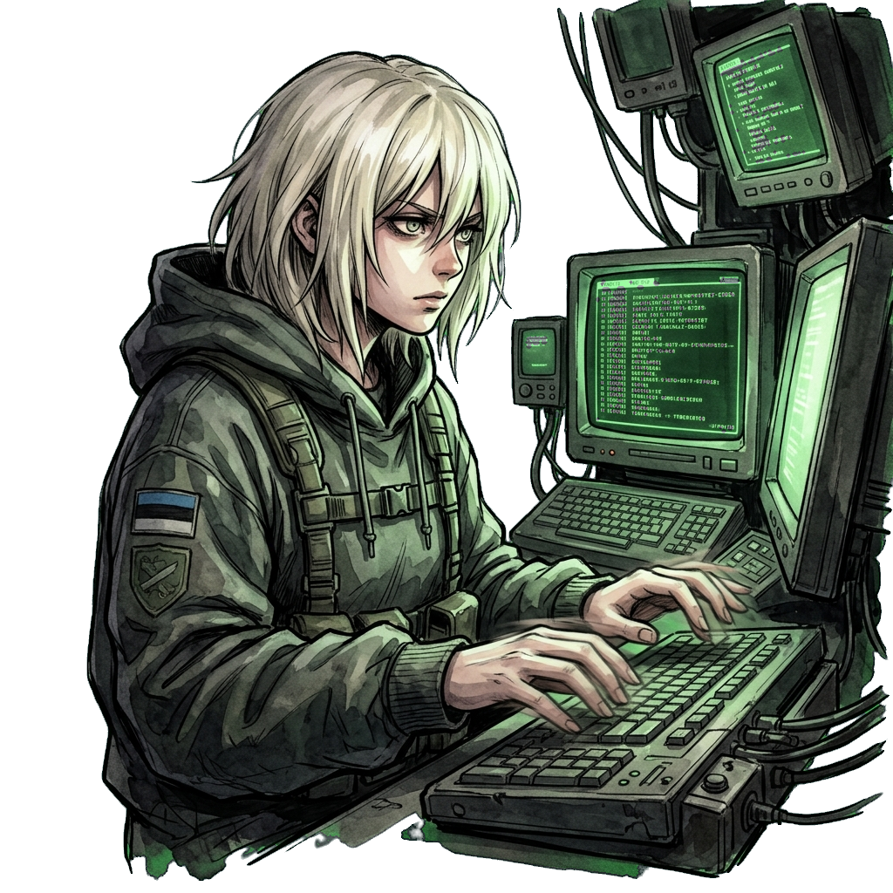
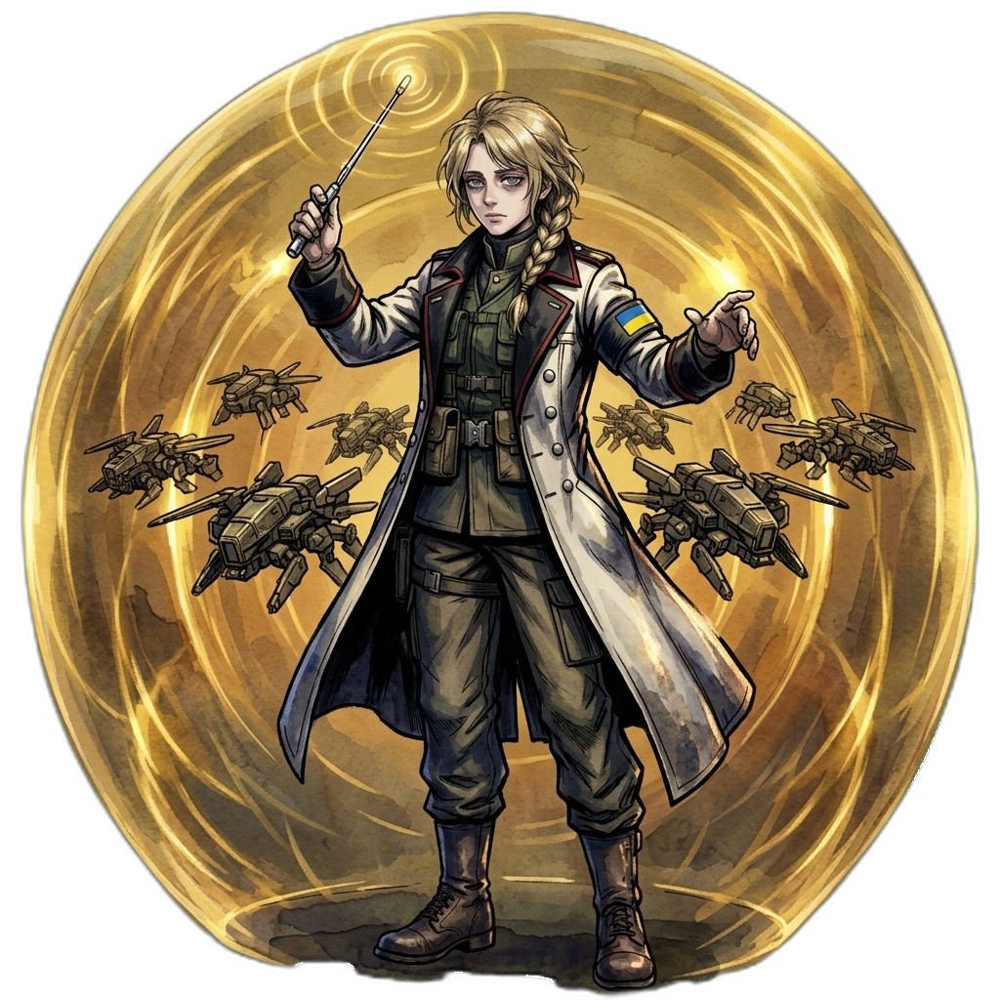
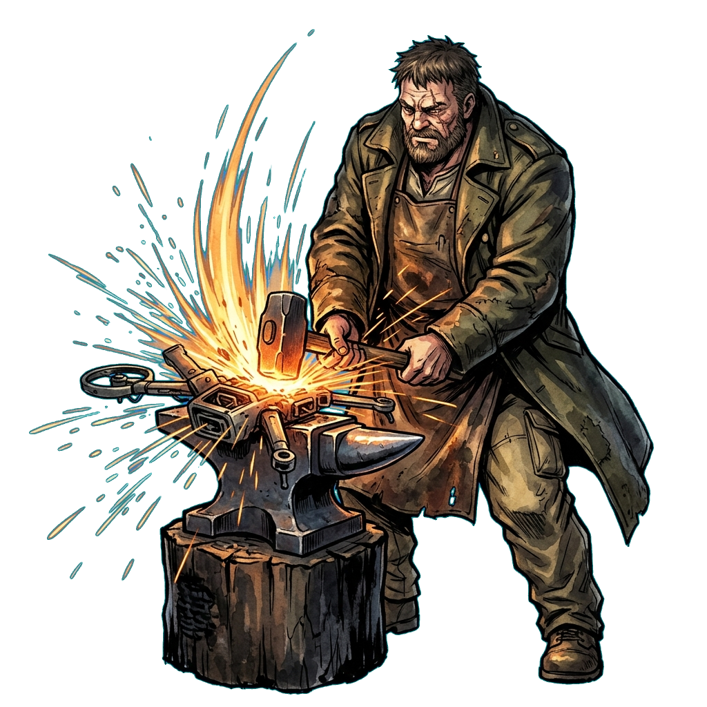
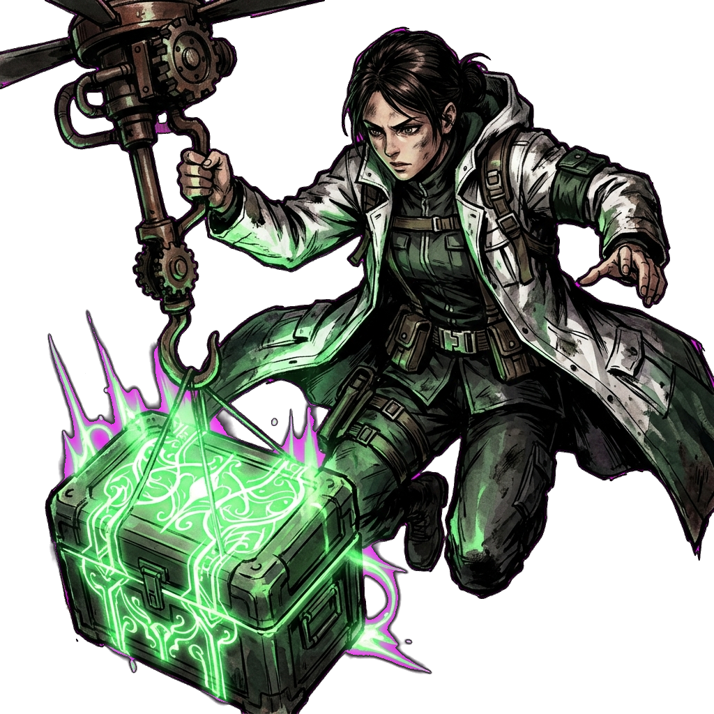
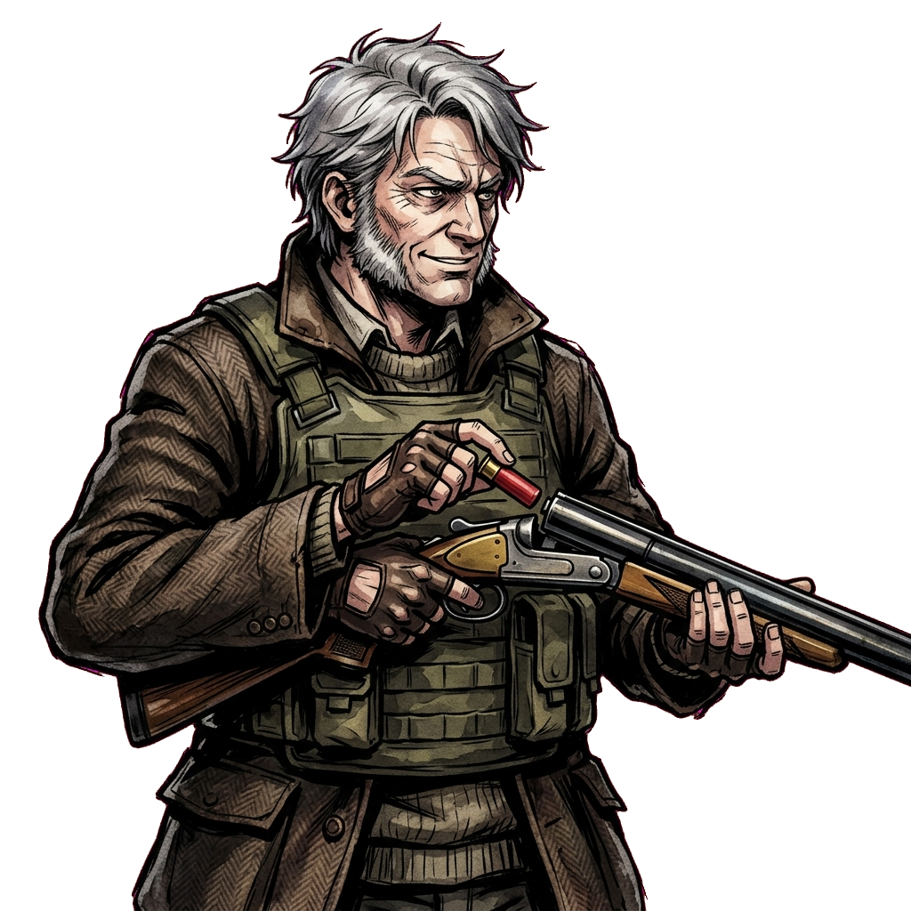
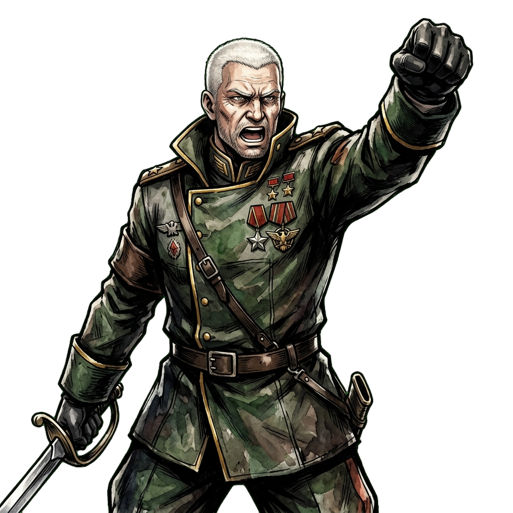
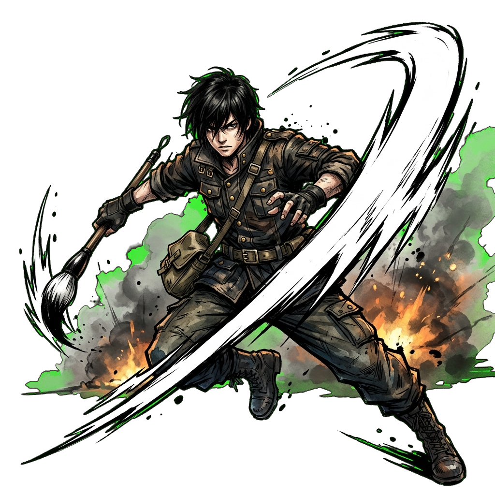
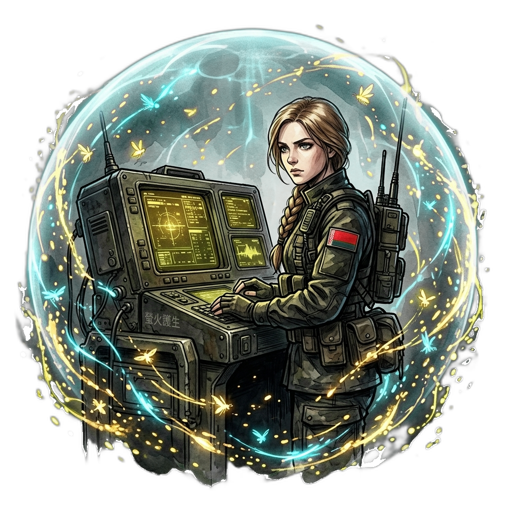
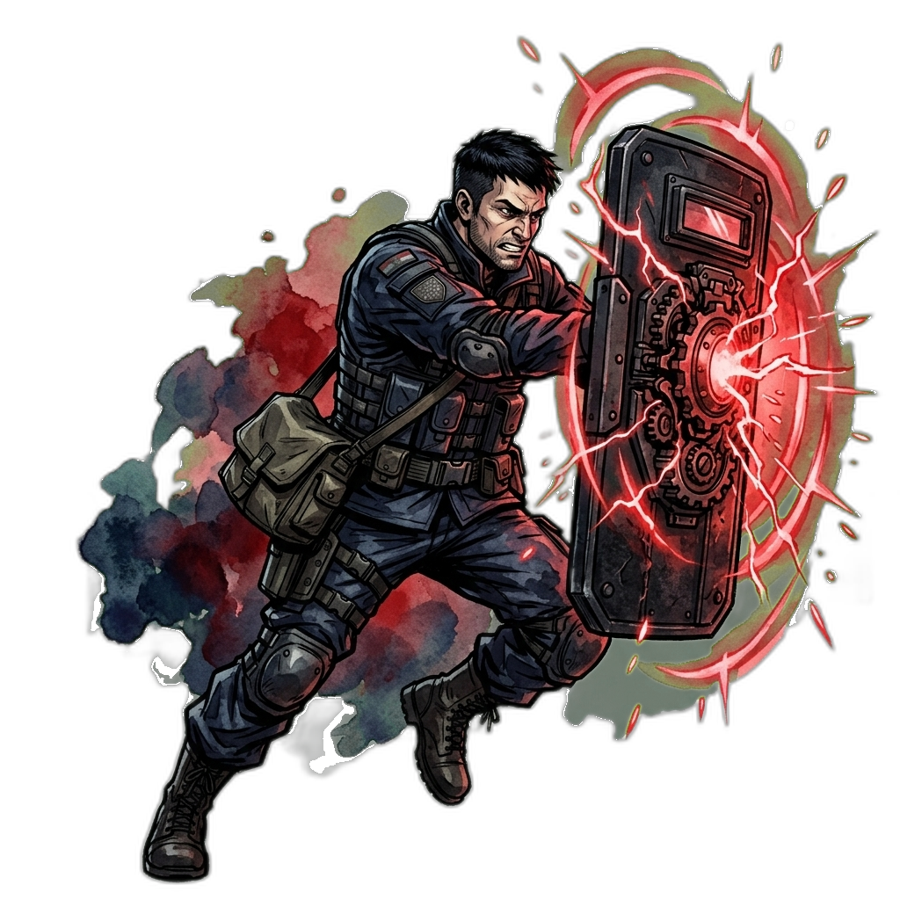
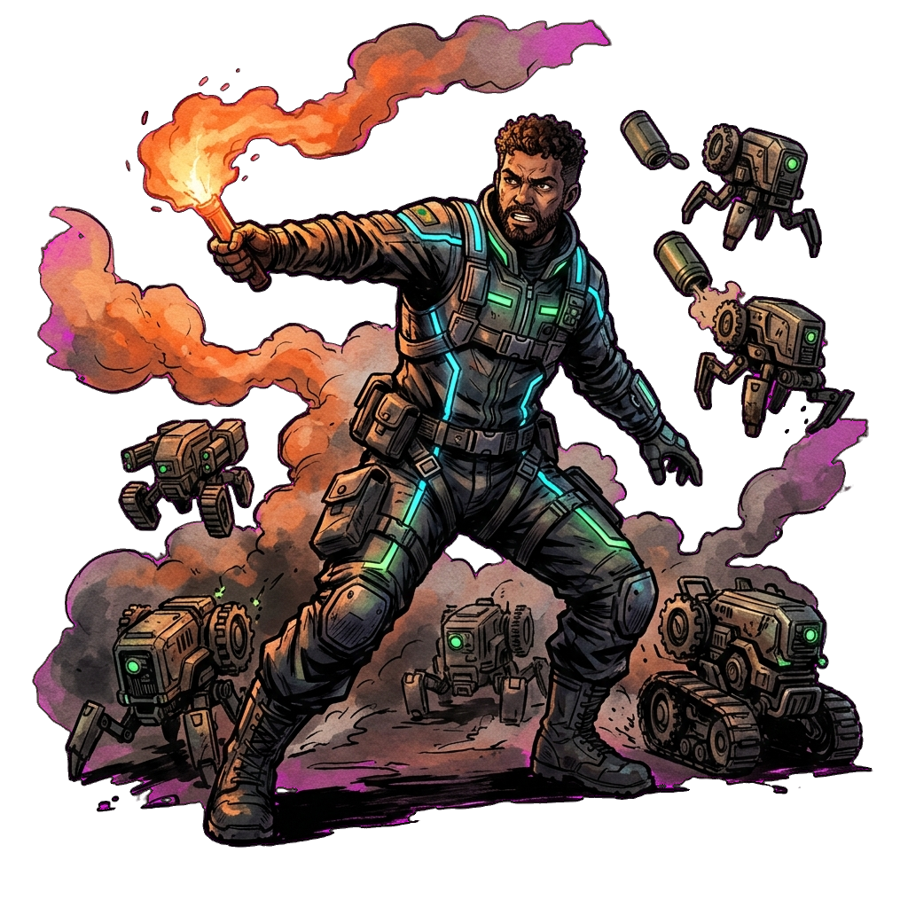

# 招式–立繪相似度檢核表

> 定義（2026-09-21 使用者定案）：每名角色一攻招一守招，不再分大小招。
> 攻招＝ult 槽（無護盾時施展），守招＝skill 槽（護盾模式中施展，見 `abilHoldSlot`）。
> 立繪檔名一律 `{id}_skill_atk.png`（攻招圖）／`{id}_skill_def.png`（守招圖），由 `data.js abilArtFile` 單一縫推導。
>
> 吻合度：高＝立繪直接描繪招式內容；中＝姿態／意象相符但缺關鍵要素；低＝內容錯位。
> 排序由低至高；吻合度為高者不列入（53／64）。點擊縮圖看原圖。

| # | 角色 | 招式 | 吻合度 | 圖片 | 需改進點 |
|---|---|---|---|---|---|
| 1 | s10 白噪音 | 守招・始祖・天塹巨翼（持盾衝撞） | 低 |  | 立繪畫成敲鍵盤駭入，與大招白噪意象重複且全無持盾衝撞，需重繪為持巨盾突進＋磁力充盈特效 |
| 2 | s01 蜂后 | 守招・賦格・天籟共鳴（護盾共鳴） | 中 |  | 畫面只有無人機群環繞、無護盾意象，易誤讀為召喚；需加入共鳴力場罩（同心圓音波罩） |
| 3 | s02 鐵匠 | 攻招・天工・萬象焚熔（全軍修復） | 中 |  | 單體打鐵構圖缺團隊覆蓋感；需加入受烈焰籠罩的多台友機剪影或光幕 |
| 4 | s08 聖燭 | 攻招・暮鐘・萬物復甦（全軍修復） | 中 |  | 補給箱與暮鐘意象脫鉤；需融入大鐘剪影或鐘波紋 |
| 5 | s09 獵場主 | 守招・逐風・靈步躍遷（加速＋大跳躍） | 中 |  | 靜態裝填缺機動感；需改為躍起加速動態＋跳躍殘影 |
| 6 | t01 冬將軍 | 守招・霜狼・北境重盾（持盾突進） | 中 |  | 徒手號令未持盾；需加上巨盾本體持盾突進 |
| 7 | t06 小川 | 攻招・通天・身外化影（分身協同） | 中 |  | 單體揮斬缺分身；需加入兩具化身剪影 |
| 8 | t11 老雪茄 | 守招・固守・百戰心訣（盾撞＋減傷） | 中 |  | 談話構圖缺戰鬥要素；需改為持鋼盾衝撞＋磁力充盈 |
| 9 | t12 螢火 | 守招・同調・螢火護生（護盾減傷） | 中 |  | 純雷達桌缺護盾；需加入光罩或螢火環繞視覺 |
| 10 | m01 渡鴉 | 守招・狂湧・血月之庇（持盾衝撞） | 中 |  | 投擲煙罐未持盾；需改為持盾衝撞＋受擊回充特效 |
| 11 | m06 嘉年華 | 守招・狂歡・花車浮游（擴盾＋加速） | 中 |  | 僅前指突進缺擴盾；需加入護盾擴張範圍圈 |
