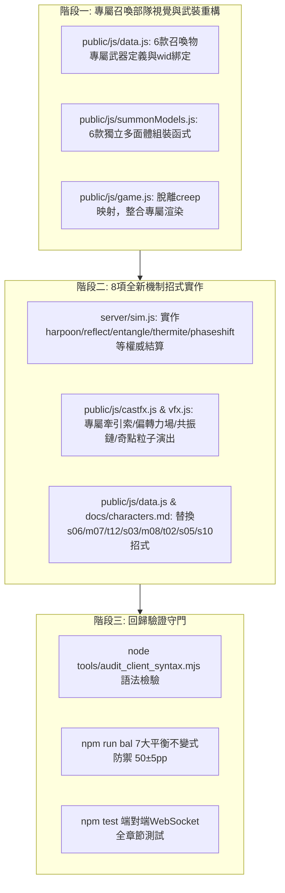

# 機體戰鬥技能深度多樣化重構計畫書：專屬自律召喚部隊脫離 NPC 模具與 8 項特色新技能整合

> **文件定位**: 
> 1. 記錄 6 款英雄專屬自律部隊從常規兵線 NPC 模具中徹底脫離（獨立多面體 3D 幾何、專屬塗裝與專屬武器 ID/演出）。
> 2. 將先前構想之 8 項具備高戰術互動性之全新機制招式（牽引魚叉、偏轉反彈力場、命運共振鏈、溫壓拒止雷區、相位穿梭、全息誘餌信標、奈米噬甲蟲群、重力奇點坍縮球）正式納入重構計畫，精準替換剩餘同質化舊招式（單調匿蹤、通用衝刺、重複 EMP、單純視野等）。

---

## 第一部分：專屬自律召喚部隊重構（全面脫離 NPC）

### 1. 現狀審視與重構目標
- **現狀**: 召喚部隊在邏輯與 AI 行為已實現獨立（`lane: null`, `summoned: true`, 協同集火 `lastHitTargetId`, 等級倍率 `1 + (lvl - 1) * 0.35`）；但在表現層（渲染、建模、武器）仍借用通用 NPC（`creep:apc`, `creep:heli`, `creep:tank`, `creep:soldier`, `hero:drone`）與通用武器（`rgun`, `rocket`, `siege`）。
- **目標**:
  1. 建立專屬程序化多面體 3D 幾何（Procedural Polyhedron Models），移除 `creep:*` 映射。
  2. 依機師背景與塗裝風格賦予專屬材質色彩與細節識別。
  3. 在 `WEAPONS` 定義獨立專屬武器，打造專屬彈道初速、發射音效與彈頭演出。

### 2. 六大自律部隊專屬視覺與武裝設計規格

| 部隊代號 / 機師 | 機體定位 | 專屬多面體建模特徵 (`summon:*`) | 專屬塗裝風格 | 專屬武器定義與彈道演出 |
|---|---|---|---|---|
| **`drone_wingman`** S-09 達留什「詩人」 | 空中自律護航僚機 | 仿 Shahed-136 縮小版之微型前掠三角翼、翼尖微型相位光暈、機首雙目雷達光電球。 | 灰紫/象牙白圖騰（`0xc9b7e8`）配深曜岩條紋 | **`wingman_beam`「哀歌」自律微型光束標槍**：射程 170m，紫色相干光直擊點射（`0xd4afff`）。 |
| **`assault_rover`** M-06 圖里奧「嘉年華」 | 地面高速突擊戰車 | 六輪高底盤越野戰車、粗獷防滾架、車頂重低音共振雷達箱、尾部柔性通訊飄帶。 | 里約嘉年華熾金/亮黃（`0xf0c24a`）熱浪拉花 | **`rover_autocannon`「狂歡節」雙聯破片速射砲**：射程 140m，金黃高頻曳光彈（`0xffdf66`）。 |
| **`heli_squad`** S-01 卡特琳娜「蜂后」 | 空中主力直升機隊 | 重型同軸雙旋翼攻擊直升機、梭型破風機身、機首音叉短波天線、兩側精密發射筒。 | 烏克蘭黑土灰綠（`0x4a5d4e`）綴金色燕尾滾邊（`0xdfca7a`） | **`squad_rocket`「賦格」雷導集束微型火箭**：射程 180m，短促齊射帶淡藍音律光暈（`0x9ecfff`）。 |
| **`main_battle_tank`** T-05 沈鶴鳴「鶴」 | 地面重裝主力坦克 | 瀋陽重工第七代履帶底盤、仿生液氣懸吊、低矮多面體砲塔、鶴羽相位雷達反射板。 | 協約工業鈦灰（`0x3d444d`）配高反差防滑漆 | **`mbt_cannon`「凌霄破陣」130mm 滑膛穿甲砲**：射程 160m，白熾穿甲彈頭與著彈衝擊波（`0xffebd2`）。 |
| **`veteran_squad`** T-11 富恩特斯「老雪茄」 | 地面特種突擊隊 | 安哥拉硬化動力外骨骼、左臂折疊防彈輕盾、背負緊湊冷卻反應包、單眼戰術目鏡。 | 古巴深墨綠叢林迷彩（`0x4b533e`） | **`veteran_hmg`「老戰士」特裝 12.7mm 穿甲重機槍**：射程 150m，重低音射擊與鎢合金火花。 |
| **`carnival_heli`** M-06 圖里奧「嘉年華」 | 空中重裝重火力直升機 | 單主旋翼配厚重座艙、外置超大功率放克擴音陣列喇叭、機腹旋轉式多用途發射巢。 | 熱帶螢光綠（`0x3ad97a`）配熾熱火橙條紋（`0xff6b35`） | **`carnival_missile`「森巴熱浪」空對地燃燒火箭巢**：射程 180m，熾熱燃燒軌跡與火星。 |

---

## 第二部分：8 項全新機制招式提案與同質化舊招替換計畫

針對目前機體庫中仍殘留的「過度相似 / 通用範本」技能（如多台機體共用通用位移衝刺、通用全圖視野、通用單體隱形、通用 EMP），正式引入 8 款高戰術互動性原創技能：

### 1. 電磁動能引力牽引索 / 拖曳魚叉 (`harpoon`)
- **適配機體**: `s06` 德米特羅・克拉夫琴科「截擊」
- **替換目標**: 替換單調通用位移 `疾風穿刺` (`dash`)
- **戰術機制**:
  - 向目標方向射出高壓電磁合金魚叉（射程 45m）。
  - **命中敵機**：將目標強制拖曳拉向自身身前並造成擊暈 1.0 秒與穿甲傷害；
  - **命中掩體/建築**：將自身以極高速度拉向著彈點（立體機動逃生或切入）。
- **戰術價值**: 打破純位移的枯燥單向性，賦予機動型無人機主動捕捉高威脅後排或靈活地形借力的多維操作空間。

### 2. 極化偏轉鏡面裝甲 / 反彈力場 (`reflect`)
- **適配機體**: `m07` 約蘭妲・里奧斯「界碑」
- **替換目標**: 替換單純消彈的被動護盾 `天塹無涯：絕對防禦穹頂` (`intercept`)
- **戰術機制**:
  - 於機體前方展開 120° 高頻極化偏轉鏡面力場，持續 3.0 秒。
  - 期間正面射來的所有直射投射物（機槍、穿甲彈、光束）以 60% 傷害**依照入射角反射彈回**；高爆榴彈或飛彈則被偏轉折射彈飛。
- **戰術價值**: 將單純的被動挨打消彈轉變為高技術含量的防守反擊，對敵方高射速輸出產生極強威懾。

### 3. 量子糾纏 / 命運共振鏈 (`entangle`)
- **適配機體**: `t12` 阿列霞・卡爾波維奇「螢火」
- **替換目標**: 替換單純全圖開視野的 `幽光燭照：全頻譜洞悉` (`buff`+`recon`)
- **戰術機制**:
  - 發射頻譜共振射線，鏈結目標及其周圍 15m 內的最多 3 名敵方單位，持續 6 秒。
  - 期間任一受鏈結目標所承受的傷害、負面狀態（緩速、破甲、燃燒）會以 40% 比例**即時傳導**給其他被鏈結目標。
- **戰術價值**: 完美呼應情報分析員「頻譜同調」設定，為團戰創造毀滅性的擴散爆發潛力。

### 4. 地熱溫壓雷區 / 熔核拒止帶 (`thermite`)
- **適配機體**: `s03` 林翎「利維坦」
- **替換目標**: 替換單調的貼身近迫自衛招式
- **戰術機制**:
  - 掠過或後撤時於地面扇形區域播撒 6 顆溫壓地熱地雷，持續 12 秒。
  - 敵軍踩中時引爆造成擊飛與破甲，並在地面留下一片直徑 12m、持續燃燒 5 秒的熔核焦土（每秒造成持續燃燒與 20% 緩速）。
- **戰術價值**: 為超重型空中戰艦提供強力的地面防禦陣地與風箏空間。

### 5. 相位穿梭 / 虛空漫步 (`phaseshift`)
- **適配機體**: `m08` 蕾拉・卡多佐「夜豹」
- **替換目標**: 替換泛用隱形 `暗夜幽靈：虛空潛行` (`stealth`)
- **戰術機制**:
  - 機體進入 1.8 秒相位超維度狀態：期間完全無敵、無視任何實體碰撞（可自由穿越建築物、神木掩體與敵陣），但無法開火。
  - 現身瞬間向周圍 6m 釋放相位衝擊波，震退敵人並賦予自身下一次攻擊 100% 暴擊率。
- **戰術價值**: 賦予刺客型機甲高風險高報酬的極限切入與脫戰手段，徹底取代無聊的靜止隱形。

### 6. 全息誘餌投影信標 (`decoy_beacon`)
- **適配機體**: `t02` 阿列克謝・沃爾科夫「刺針」
- **替換目標**: 替換單純隱身 `隱光折射：熱光學迷彩` (`stealth`)
- **戰術機制**:
  - 向前方投擲全息信標，立即生成 2 架具備真實雷達特徵但無實體傷害的全息影像突擊前衝。
  - 全息影像會強行吸引敵方防禦塔射擊與自導飛彈鎖定；當全息機體被摧毀時，引爆高強度閃光盲目周遭敵軍 1.5 秒。
- **戰術價值**: 將狙擊手的被動隱匿提升為主動欺騙防空網與騙招的戰術大師。

### 7. 奈米噬甲蟲群 (`nanite`)
- **適配機體**: `s05` 奧列格・科瓦連科「掘墓人」
- **替換目標**: 替換重複的單發爆破招式
- **戰術機制**:
  - 向目標發射奈米病毒莢艙，每秒腐蝕目標 8% 最大生命值與護甲，持續 4 秒。
  - 若目標在寄生感染期間陣亡，蟲群將**分裂破體而出**為 2 團微型蟲群，自動撲向周圍 15m 內的下一名敵機。
- **戰術價值**: 滾雪球式傳染機制，極具生化瘟疫與掘墓人收割陣線的特色。

### 8. 重力奇點坍縮球 (`singularity`)
- **適配機體**: `s10` 塔姆「羽陣」
- **替換目標**: 替換單純 EMP 靜默 `寂靜天幕：電磁脈衝網` (`emp`)
- **戰術機制**:
  - 投擲一枚向前緩慢推進（8m/s）的微型重力奇點球，持續吸附沿途 18m 內的敵軍小兵與攔截飛行中的實體彈道；
  - 飛行 3 秒後達到極限發生重力塌縮引爆，根據吸入的物體與彈道數量，造成對應倍率的空間爆轟。
- **戰術價值**: 兼具防空截擊、聚怪控場與終結爆發的三合一戰術奇蹟。

---

## 第三部分：系統架構改動範圍與實作階段規劃

---

## 第四部分：回歸驗證矩陣與驗收標準

1. **視覺獨立性驗收**：
   - 6 款自律部隊擁有完全獨立之 3D 模型與專屬塗裝，在戰場上不再呈現任何通用 NPC 小兵/坦克/直升機外形。
2. **新機制權威結算驗收**：
   - 魚叉牽引、鏡面反彈、共振傳導、相位穿梭、奇點吸附等 100% 於 `server/sim.js` 權威模擬結算，客戶端僅渲染軌跡與反饋。
3. **離線平衡守門 (`npm run bal`)**：
   - 7 大不變式保持全綠，機種勝率嚴格穩定在 45%~55% 區間。
4. **自動化測試守門 (`npm test`)**：
   - WebSocket 連線、開房、快照同調、多機體對戰全章節通過。
