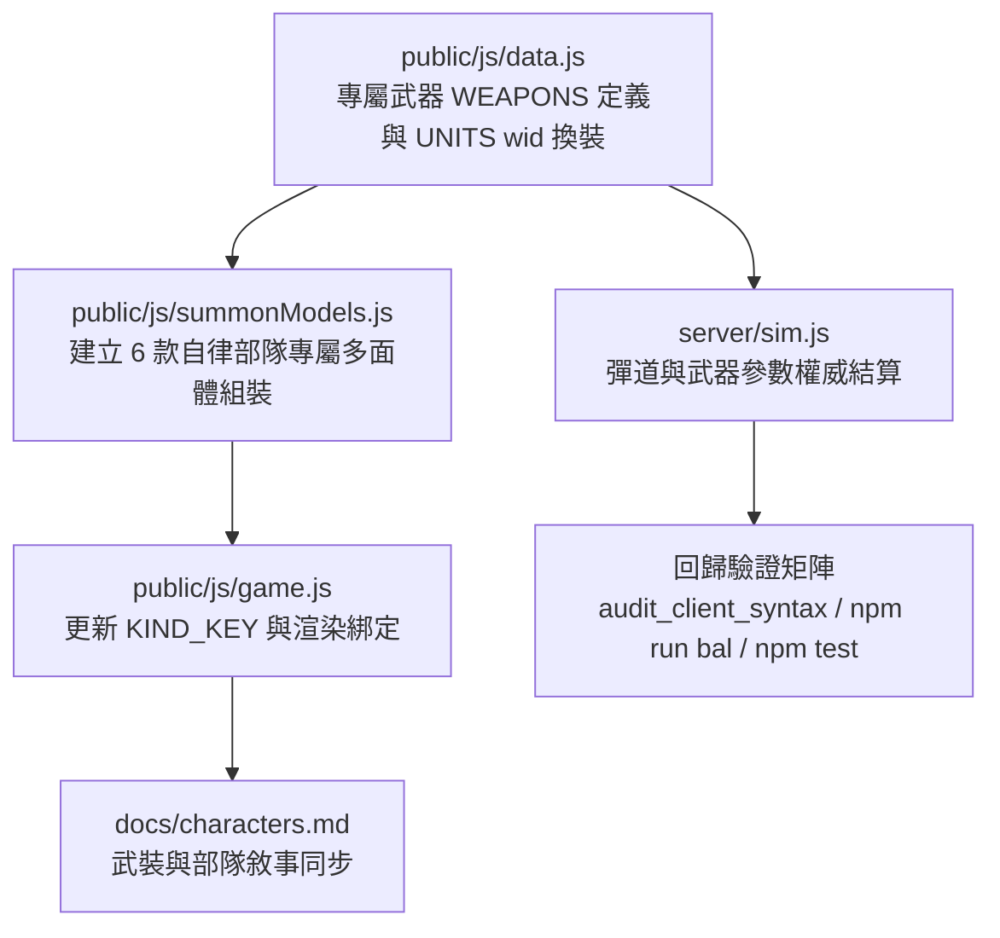

# 專屬自律召喚部隊重構計畫書：外觀建模、渲染塗裝與獨立武裝全面脫離 NPC

> **文件定位**: 記錄 6 種英雄召喚部隊脫離常規兵線 NPC 模具、建立專屬程序化 3D 幾何（Procedural Polyhedron Models）、獨立塗裝識別與專屬武器系統的架構與執行計畫。

---

## 1. 現狀審視與重構目標

### 1.1 現狀盤點
在先前改動中，6 款召喚部隊已在邏輯與 AI 行為層面脫離了普通兵線小兵：
- 脫離兵線巡邏（`lane: null`, `summoned: true`），具備脫戰陣型跟隨。
- 具備戰術協同集火（`lastHitTargetId`）與技能等級倍率成長機制（`scale = 1 + (lvl - 1) * 0.35`）。
- **然而在表現層（視覺外觀、渲染材質、武器系統）仍完全借用通用 NPC**：
  - `drone_wingman` $\rightarrow$ 映射通用無人機 `hero:drone`
  - `assault_rover` $\rightarrow$ 映射兵線裝甲車 `creep:apc`
  - `heli_squad` $\rightarrow$ 映射兵線通用直升機 `creep:heli`
  - `main_battle_tank` $\rightarrow$ 映射兵線通用坦克 `creep:tank`
  - `veteran_squad` $\rightarrow$ 映射兵線通用步兵 `creep:soldier`
  - `carnival_heli` $\rightarrow$ 映射兵線通用直升機 `creep:heli`
  - 武器使用通用 `rgun`、`rocket`、`siege`，缺乏召喚者的戰術主題。

### 1.2 重構目標
1. **專屬程序化多面體 3D 幾何**：依照機師背景與機體風格量身打造專屬模型，徹底移除 `creep:*` 映射。
2. **鮮明塗裝與細節特徵**：結合陣營色彩與機師個人識別符號（如音樂總譜飾邊、狂歡節螢光、仿生幾何裝甲、老兵外骨骼等）。
3. **專屬武裝定義與彈道演出**：在 `WEAPONS` 定義獨立武器，賦予專屬彈道初速、射擊節奏、光束/彈頭特效與音效層級。
4. **守門不變式相容**：維持真實世界尺度與碰撞體積不變，100% 通過 `npm run bal` 與 `npm test`。

---

## 2. 六大自律部隊專屬視覺與武裝設計規格

### 2.1 S-09 達留什・法拉赫扎德「詩人」— 自律巡弋無人機 (`drone_wingman`)
- **定位**: 空中自主護航僚機（無人機）
- **外觀建模 (`summon:drone_wingman`)**:
  - **機身**: 仿造 Shahed-136 縮小版之微型前掠三角翼（Delta-canard），銳利幾何邊緣。
  - **特徵**: 機背刻印微型波斯詩文飾線、翼尖具備微型相位光暈、機首下垂式雙目雷達光電球。
  - **塗裝**: 灰紫/象牙白交錯圖騰（`0xc9b7e8` 底色配深曜岩條紋）。
- **專屬武器 (`wid: 'wingman_beam'`)**:
  - **名稱**: `「哀歌」自律微型光束標槍`
  - **機制**: 射程 170m，高速固態雷射點射，光速直擊，紫相干光束演出（`0xd4afff`）。

### 2.2 M-06 圖里奧・費雷拉「嘉年華」— 自律斥候戰車 (`assault_rover`)
- **定位**: 地面高速突擊戰車（機甲小招）
- **外觀建模 (`summon:assault_rover`)**:
  - **機身**: 六輪高底盤全地形越野斥候車，具備粗獷防滾架與外露傳動軸。
  - **特徵**: 車頂搭載加裝低音震膜外型的共振雷達箱、尾部立起帶螢光飄帶之柔性通訊旗標。
  - **塗裝**: 里約嘉年華熾金/亮黃（`0xf0c24a` 底色配熱帶熱浪拉花）。
- **專屬武器 (`wid: 'rover_autocannon'`)**:
  - **名稱**: `「狂歡節」雙聯破片速射砲`
  - **機制**: 射程 140m，高射速雙聯裝機砲，初速 850m/s，帶金黃曳光彈道（`0xffdf66`）。

### 2.3 S-01 卡特琳娜・薛甫琴科「蜂后」— 交響武裝直升機隊 (`heli_squad`)
- **定位**: 空中主力武裝直升機編隊（無人機大招）
- **外觀建模 (`summon:heli_squad`)**:
  - **機身**: 重型同軸雙旋翼攻擊直升機，機身呈長形梭式破風結構。
  - **特徵**: 機首伸出音叉形狀的高精度短波天線、兩側短翼懸掛精密多聯裝火箭發射筒。
  - **塗裝**: 烏克蘭黑土灰綠（`0x4a5d4e`）綴以燕尾指揮外套的金色滾邊（`0xdfca7a`）。
- **專屬武器 (`wid: 'squad_rocket'`)**:
  - **名稱**: `「賦格」雷導集束微型火箭`
  - **機制**: 射程 180m，多聯裝短促齊射，初速 720m/s，火箭尾跡帶淡藍音律光暈（`0x9ecfff`）。

### 2.4 T-05 沈鶴鳴「鶴」— 自律主戰坦克 (`main_battle_tank`)
- **定位**: 地面重裝攻堅主力坦克（機甲大招）
- **外觀建模 (`summon:main_battle_tank`)**:
  - **機身**: 瀋陽重工第七代實驗型履帶底盤，仿生液氣懸吊系統，多面楔形重裝甲。
  - **特徵**: 無人遙控角型低矮砲塔，砲盾上方安裝仿生鶴羽造型之相位陣列雷達反射板。
  - **塗裝**: 協約標準工業鈦灰（`0x3d444d`）配高反差防滑漆與磨損工廠廠徽。
- **專屬武器 (`wid: 'mbt_cannon'`)**:
  - **名稱**: `「凌霄破陣」130mm 滑膛穿甲砲`
  - **機制**: 射程 160m，高穿甲超高壓滑膛砲，初速 1650m/s，白熾穿甲彈頭與衝擊震波（`0xffebd2`）。

### 2.5 T-11 拉斐爾・富恩特斯「老雪茄」— 精銳老兵突擊隊 (`veteran_squad`)
- **定位**: 地面特種步兵小隊（可變機甲大招）
- **外觀建模 (`summon:veteran_squad`)**:
  - **機身**: 身著安哥拉戰役硬化動力外骨骼的精銳突擊步兵。
  - **特徵**: 左臂配備折疊式防彈輕盾、背部揹負緊湊型高壓冷卻反應背包、頭盔有單眼戰術目鏡。
  - **塗裝**: 經典古巴叢林迷彩（`0x4b533e` 深墨綠混雜泥斑）。
- **專屬武器 (`wid: 'veteran_hmg'`)**:
  - **名稱**: `「老戰士」特裝 12.7mm 穿甲重機槍`
  - **機制**: 射程 150m，重型氣動機槍，初速 880m/s，重低音射擊頻率與鎢合金破甲火花。

### 2.6 M-06 圖里奧・費雷拉「嘉年華」— 嘉年華直升機隊 (`carnival_heli`)
- **定位**: 空中重裝重火力直升機編隊（機甲大招）
- **外觀建模 (`summon:carnival_heli`)**:
  - **機身**: 改裝版重型攻擊直升機，單主旋翼配尾槳，厚重裝甲座艙。
  - **特徵**: 機體兩側懸掛外置超大功率放克擴音陣列喇叭、機腹掛載旋轉式重型多用途發射巢。
  - **塗裝**: 熱帶螢光綠底色（`0x3ad97a`）配熾熱火橙條紋（`0xff6b35`）。
- **專屬武器 (`wid: 'carnival_missile'`)**:
  - **名稱**: `「森巴熱浪」空對地燃燒火箭巢`
  - **機制**: 射程 180m，高速拋射燃燒火箭，初速 650m/s，著彈爆散熾熱火星。

---

## 3. 系統模組改動範圍與時程規劃

### 3.1 具體執行步驟
1. **第一階段：數值真相與專屬武器配置 (`public/js/data.js`)**
   - 於 `WEAPONS` 新增 `wingman_beam`、`rover_autocannon`、`squad_rocket`、`mbt_cannon`、`veteran_hmg`、`carnival_missile` 獨立條目。
   - 於 `UNITS` 中將對應召喚物的 `wid` 指向專屬武器，配置對應武器射程、初速、散射與彈道類型。
2. **第二階段：專屬多面體幾何組裝模組 (`public/js/summonModels.js`)**
   - 獨立建立專屬召喚物模型生成檔案，遵循微尺寸規格（`fitToHeight`）、A25 GPU 資源釋放規則。
   - 宣告式組裝各部隊幾何構件（如直升機音叉天線、漫遊車共鳴箱、坦克仿生鶴羽雷達、外骨骼戰術盾等）。
3. **第三階段：渲染管線與動畫節奏銜接 (`public/js/game.js`)**
   - 將 `KIND_KEY` 中的 `drone_wingman`、`assault_rover` 等映射至 `summon:*`。
   - 於 `_spawnUnit` 注入專屬模型生成器，設定專屬旋轉槳葉與履帶動態。
4. **第四階段：全面回歸測試與守門防線**
   - 執行 `node tools/audit_client_syntax.mjs`。
   - 執行 `npm run bal` 確保 7 大核心不變式通過，維持 45%~55% 機種與陣營對抗平衡。
   - 重啟伺服器並執行 `npm test`（`test/e2e.mjs`）。

---

## 4. 驗證清單與驗收標準

- [ ] **視覺脫離驗證**: 進入對戰後，召喚出的單位外觀有專屬多面體組裝，不再與普通兵線 NPC 重疊。
- [ ] **彈道演出驗證**: 專屬武器發射之彈道、尾跡色彩與初速演出符合各自設計規格。
- [ ] **語法與匯入完整性**: `audit_client_syntax.mjs` 268+ 項全綠。
- [ ] **平衡不變式防禦**: `npm run bal` 7 大平衡不變式無紅字。
- [ ] **端對端測試通過**: `npm test` 單元與網路連線測試全部通過。
