# 主線劇情 — 無人戰略:鋼鐵與蜂群(2022–2031)

> **內部設計文件。**平行時空之虛構創作,靈感取材自現實事件,與真實人物、單位無涉。
> **機體編制**:2031 年雙方均已混編三種機體(蜂群 7/3/2、鋼鐵 3/7/2、傭兵 2/2/4);
> 主義沒變,編制變了 —— 詳見 [characters.md 「機體混編」](characters.md)。
> 角色設定與原型三分律見 [characters.md](characters.md)(角色編號 S/T/N-XX 均指向該文件)。
> **2026-08-03 對帳**:本檔曾引用一批從未進入可駕駛名冊的傭兵(艾拉・德米爾、雪豹、恩科西、
> 阿米娜・奧蒂諾…),已改寫成實際出貨的 N-01~N-08;**信使米菈**維持登場,但明確標為
> **非可駕駛的世界角色**(前線信使),她不佔傭兵八席。
> **與遊戲的關係**:每一場對戰 = 《信使協定》之後,膠著戰線上的一次「例行交鋒」——
> 這解釋了為什麼雙方座機都由人類英雄駕駛/操縱(協定禁止無人在環的交戰迴路),
> 也解釋了無人機重生無冷卻(機體可拋棄)與機甲重生有冷卻(機體昂貴、駕駛員彈射)的機制差異。

---

## 序幕:四百八十美元(2022–2025)

````carousel
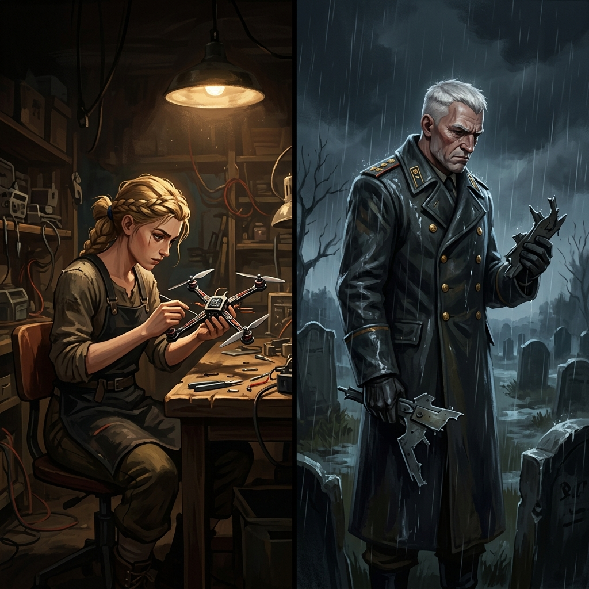
<!-- slide -->
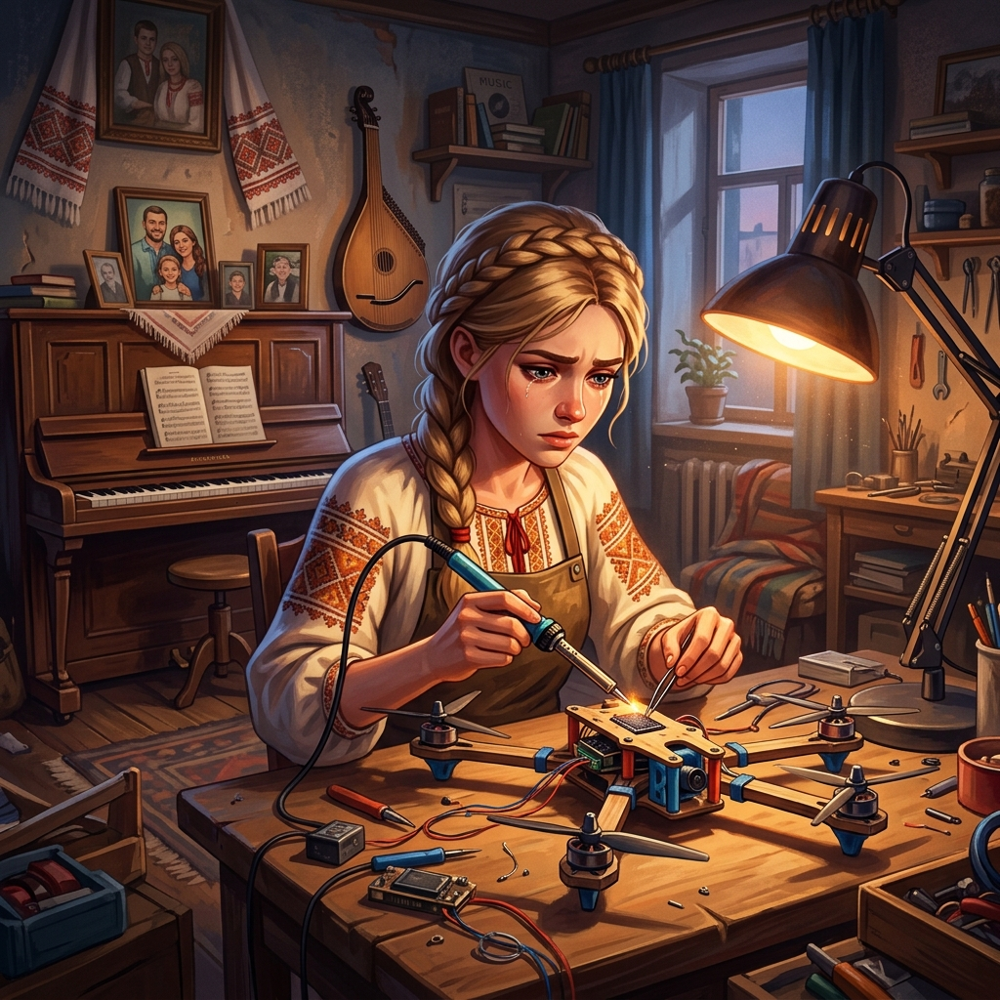
<!-- slide -->
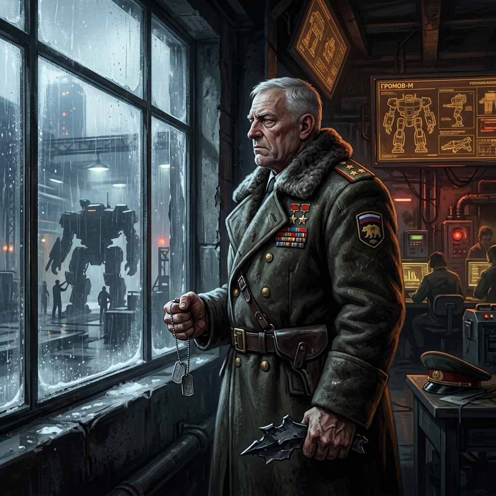
````

2022 年,東歐戰爭爆發,與我們的時空一模一樣——直到兩場葬禮讓它岔了出去。

**第一場葬禮**在馬里烏波爾郊外。音樂老師卡特琳娜・薛甫琴科(S-01)埋葬了弟弟,
棺木裡放著他沒修完的一台四軸飛行器。她把飛行器帶回家修好,三個月後帶著它報到志願隊。

**第二場葬禮**在莫斯科近郊。瓦列里・格羅莫夫上將(T-01)的獨子——一名普通機槍手——
死於蜂群突襲,屍體旁是一台造價 **480 美元**的自殺無人機殘片。
葬禮後第三天,他向總參提交重裝雙足平台量產案,附言只有一句:
「一枚四百八十美元的無人機,換走了我一場三百萬美元也買不回的葬禮。**給我的士兵穿上鋼鐵。**」

一邊選擇了「機器可以死,人不行」,一邊選擇了「用鋼鐵包住人」。
**蜂群主義**與**鋼鐵主義**,從同一種悲傷裡誕生。

**蜂群視角(卡特琳娜・薛甫琴科)**:她把弟弟沒修完的四軸飛行器擺在工作台上,足足三天沒碰。修好那天她沒有哭——那架小小的飛行器成了她第一件不再是「模型社的作業」、而是「必須飛起來的東西」。她後來對新兵說:「悲傷會過期,任務不會。所以我們讓機器去死,不讓人去死。」

**鋼鐵視角(瓦列里・格羅莫夫)**:他在殯儀館走廊站了整夜,手裡捏著從殘骸上取下、印著「480」美元字樣的電路板碎片。後來他把它鎖進辦公桌最底層的抽屜,和獨子的追授勳章放在一起——兩樣東西都不掛出來,因為掛出來,就等於承認這筆帳已經算完了。

**第三方視角(不結盟市場)**:市場永遠比政令快一步嗅到風向。兩場葬禮之後不到半年,某軍工世家的訂單簿上,「消耗型無人機」與「重裝步行平台」兩欄同時往上爬——沒有人正式宣布過任何主義,但供應鏈已經替兩種未來各自報了價。

---

## 第一幕:車庫與兵工廠(2026–2029)

````carousel
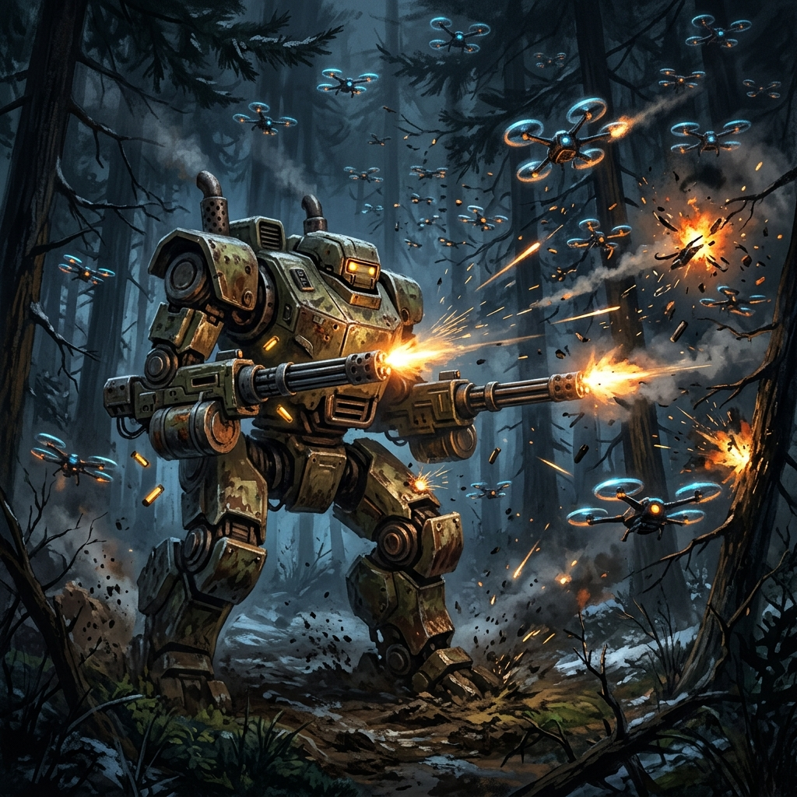
<!-- slide -->
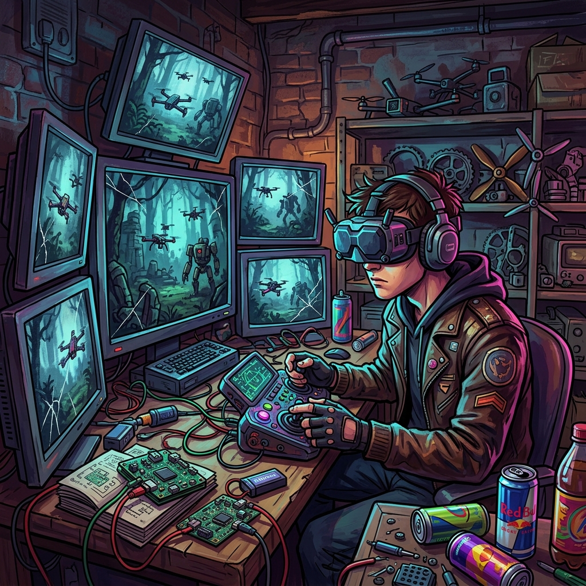
<!-- slide -->
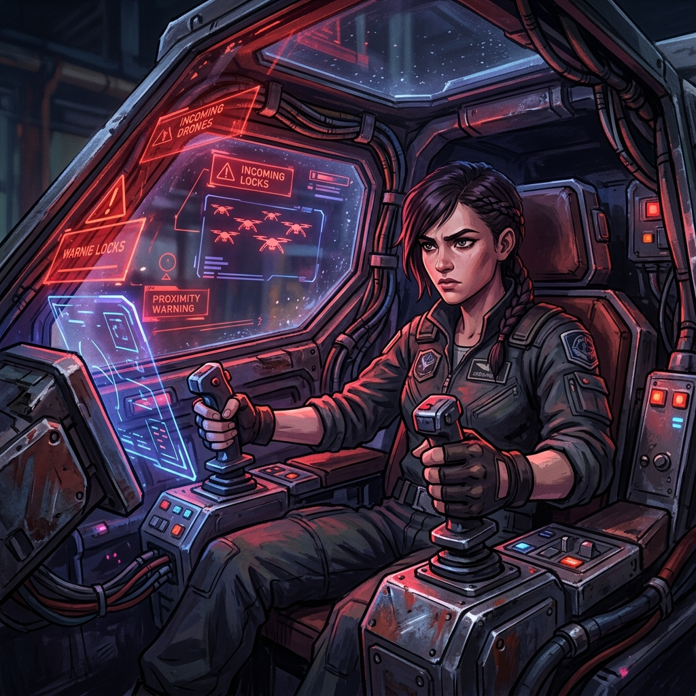
````

2026 年黑海事件、2027 年東亞第二戰線與以伊開戰之後(詳見 characters.md 時間線),戰爭全球化。

**蜂群這邊**:塔拉斯・邦達爾(S-02)把哈爾科夫的車庫改裝經驗寫成開源標準《蜂巢協議》,
任何國家的志願者用五金行零件就能拼出制式機。17 歲的卡佳・塔姆(S-10)給協議貢獻了加密層,
提交說明只有一行:「舊的那個聽起來就很假。」薛甫琴科以音樂式的多機指揮法組建王牌中隊
「**第聶伯蜂巢**」——她的作戰紀錄檔在參謀部被稱為「總譜」。

**協約這邊**:瀋陽,沈鶴鳴(T-05)在量產評審會上摔了偷工的傳動樣件(「這個膝蓋會在第兩百次跳躍時斷裂」),
被記過、設計被改回;同年,神經介面計畫「**加拉泰亞**」啟動,七個孤兒院孩子進了實驗室。
2029 年結案報告上只剩一個名字:薇拉・佐洛塔列娃,編號七(T-02)。

**首次王牌對決(2029,黑森林戰區)**:灰雁・奧爾洛娃(T-04)單機突入第聶伯蜂巢的指揮縱深,
薛甫琴科用 41 機的損失換她彈藥耗盡。兩人都沒能殺死對方,兩人都把對方寫進了筆記——
灰雁的獵殺名單添了「蜂后」,蜂后的總譜多了一行變奏註記:「**有一種獨奏,合奏攔不住。**」

同一週,烏蘇拉・林德特(N-03)做成了她第一筆「同頁帳本」生意:同型零件,兩張訂單,兩個陣營,
同一張費率表。
艾德蒙・惠特洛克(S-09)變賣兩幅家傳油畫,「獵場看守人」中隊的貨箱烙著牧場火印運抵前線。

**蜂群視角(塔拉斯・邦達爾)**:他把《蜂巢協議》寫成任何人都能看懂的圖紙時,特意留了一行給後來人:「手邊沒有標準零件,就用你有的東西——反正它們只要飛得起來、打得中,壞了再修。」車庫文化第一次有了共同語言,而語言的第一句話是:不完美也能上戰場。

**鋼鐵視角(沈鶴鳴)**:摔樣件那天她的手其實在抖,不是因為憤怒,是因為她算過:偷工的傳動件撐不過兩百次跳躍,而每一次跳躍裡都坐著一個十九、二十歲的孩子。那份記過處分書,她後來裱框掛在辦公室,旁邊掛著設計改回原案的批准公文——一份提醒她妥協的代價,一份提醒她堅持有用。

**第三方視角(艾德蒙・惠特洛克)**:「獵場看守人」的第一批貨箱運抵前線那天,他站在碼頭邊看著吊車卸貨,想起父親說過的話:家傳的東西,傳到某一代總要用來換點更要緊的。兩幅油畫換二十台機體,他覺得這是他這輩子做過最划算的一筆交易,即使牧場的會計不這麼想。

---

## 第二幕:第二戰線(2029–2030)

````carousel
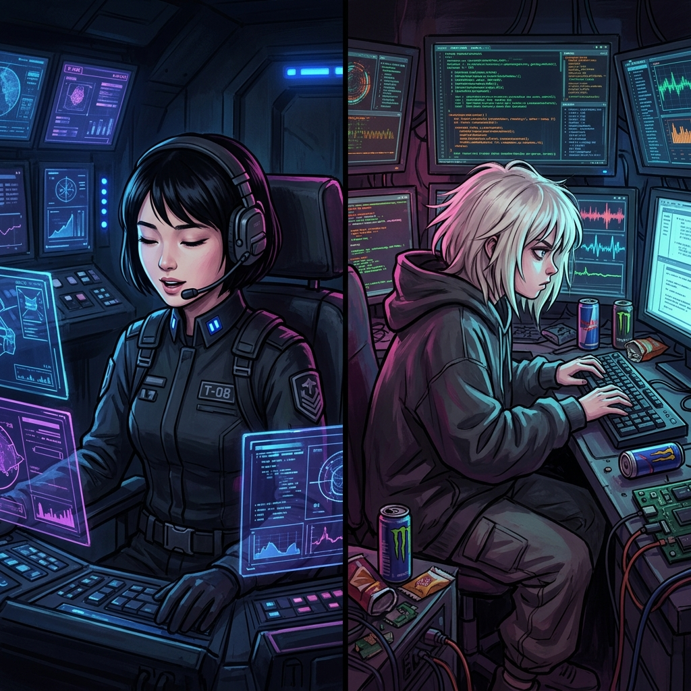
<!-- slide -->
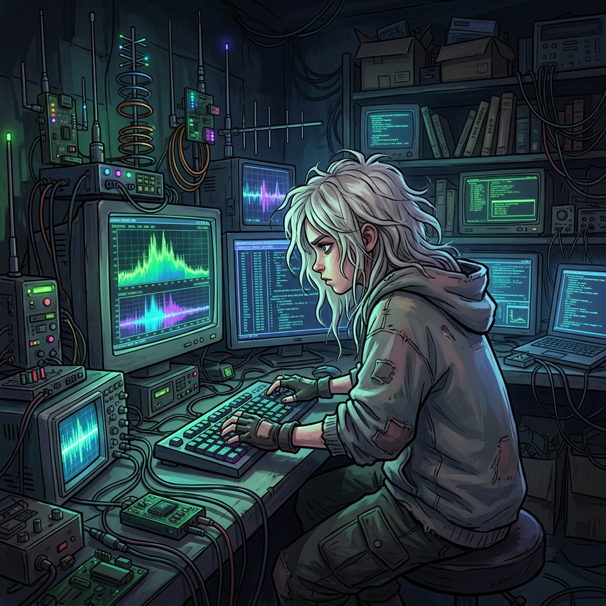
<!-- slide -->
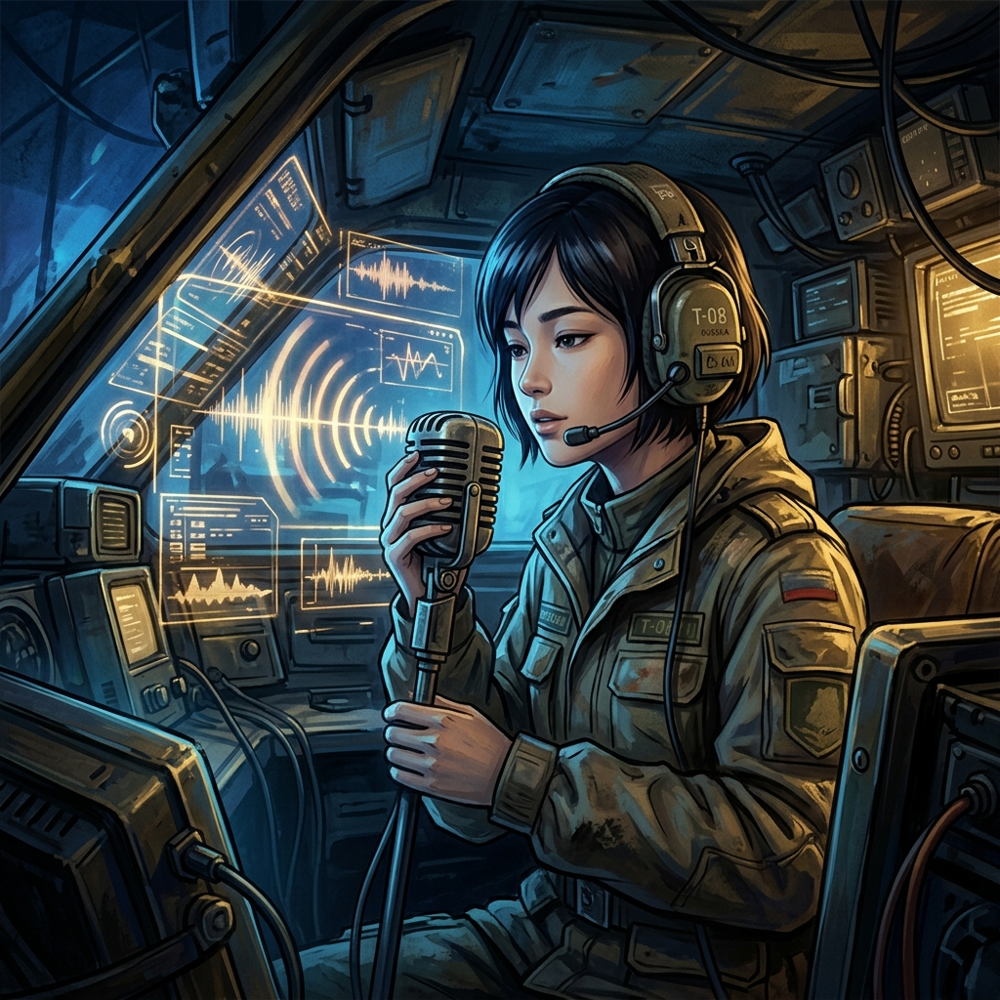
````

**產線之夜**:台海戰事波及新竹的那一晚,林翎(S-03)抱著一盒晶圓進掩體,
出來後在同盟技術交換計畫的申請欄寫:「我的晶片會飛,我不會,所以我去它們在的地方。」
(這句話兩年後失效:2031 年同盟替她做出「靜電」——囊體即共形陣、張耳即天線陣的
飛鯨 ↔ 機械巨象可變機,她從此親自把每一版韌體飛上去驗,呼號也從「Silicon」換成了「半羽」。)
她的反干擾晶片列裝後,首爾出身的河瑟琪(S-05)成了頭號受益人——
兩人為了韌體規格隔海吵了三個月,issue 清單長得像情書合集,後來誰也不肯關掉那個 repo。

**搖籃曲事件**:協約電戰員韓雪(T-08)一夜癱瘓整條兵線的通訊,
22 名蜂群操作員回報同一句話:「耳機裡有人在唱歌。」
同盟急調卡佳・塔姆對抗;此後半年的頻譜攻防被戰史寫作「**二重唱**」——
一邊用絕對音感手織干擾波形,一邊用演算法即時反制,雙方的參謀都聽不懂,只能看勝負。
卡佳不知道的是:她每週下圍棋的匿名棋友 firefly_bel(T-12 阿列霞),
就在對面陣營的訊號掃描席上——兩人在頻譜裡其實交過手,而棋盤上誰也沒提過戰爭。

**信使路線成形**:羅姆少女米菈(**前線信使,非可駕駛角色**)的背包無人機隊開始每日三次穿越前線。
北韓狙擊手李正赫(T-07)的第一封信經她的手寄往首爾。回信他讀完就燒,灰燼按進彈殼裡隨身帶。

樫村蒼真(S-04)在東線開設「鐵鍬課」;富恩特斯(T-11)的顧問團抵達協約前線,
他與格羅莫夫用安哥拉黑話通信重逢——兩個老兵的第一封信只有一句:「罐頭還是老地方薄。」

**蜂群視角(林翎)**:交出申請表的那個晚上,她重新算了一次自己設計的晶片能讓存活率提升多少——三倍。三倍不是安慰用的數字,是她願意離開新竹、離開家人、飛到八千公里外的理由。「我的晶片會飛,我不會,所以我去它們在的地方」,這句話後來被印上了同盟的招募海報,她本人始終覺得有點難為情。

**鋼鐵視角(韓雪)**:第一次在演出服和電戰服之間切換身分時,她發現自己分不太清楚哪一套才是「真正的自己」。舞台上她唱給觀眾聽,頻譜裡她唱給二十二副耳機聽——兩種掌聲她都聽不到,但兩種沉默,她都記得。

**第三方視角(烏音嘎・策倫)**:「二重唱」打得最烈的那幾週,她正沿著前線邊緣找一架墜毀的偵察機——那不是戰鬥合約,是一筆單純的「找到它」。泥地上的痕跡告訴她操作員彈射成功了,只是走得很急,鞋印一深一淺。她把找到的殘骸拍照存檔,筆記裡寫下:「雙方在天上打頻譜的時候,地上總還是有人,只是想活著走出去。」

---

## 第三幕:膝蓋戰爭(2030)

````carousel
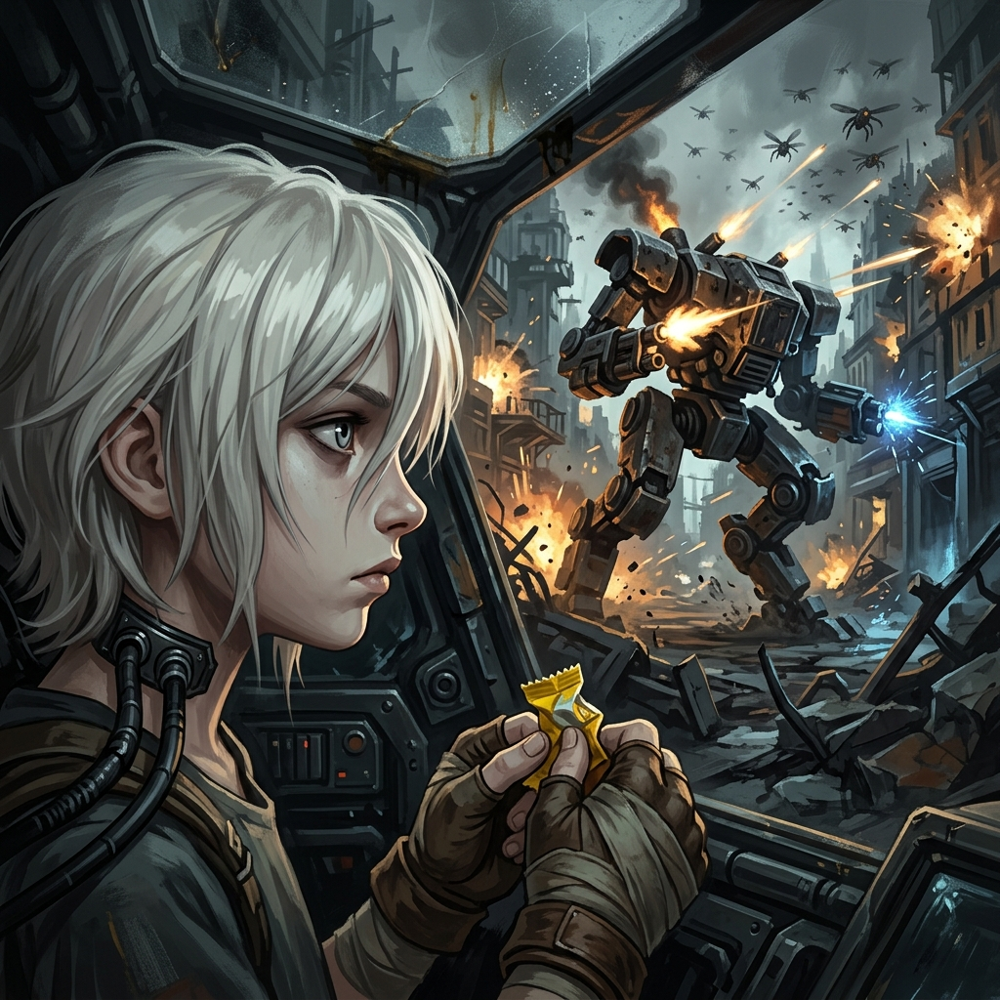
<!-- slide -->
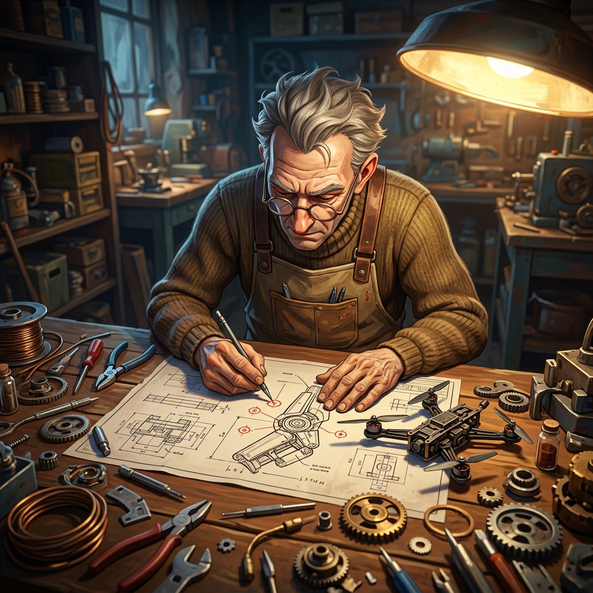
<!-- slide -->
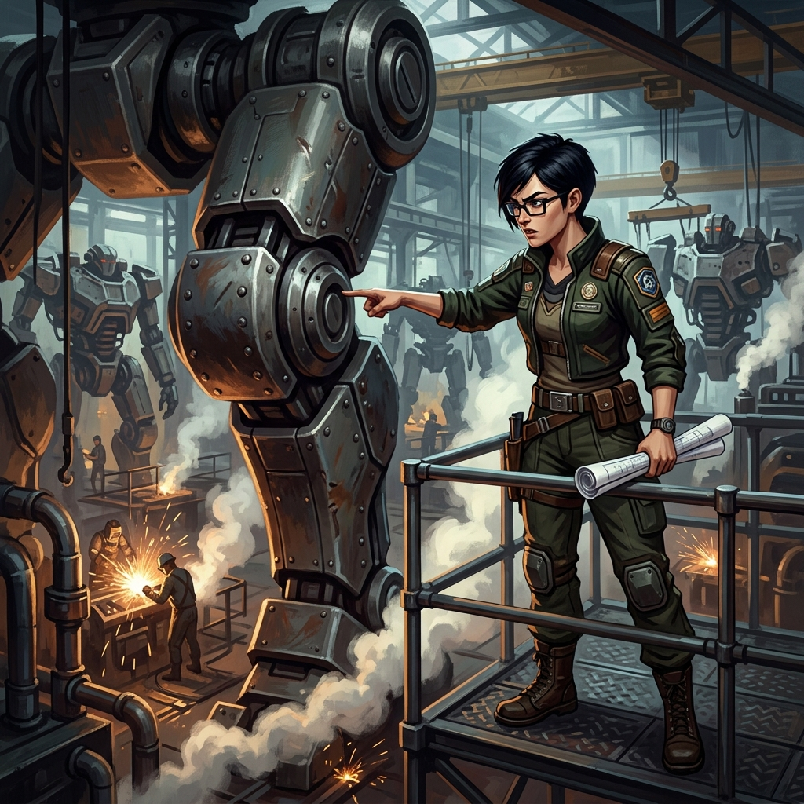
````

維爾納・哈特曼(S-11)出庭作證自家公司的關節模組流入協約,隨後叛逃同盟。
他設計的「**斷膝**」攔截戰術——專打步行平台的傳動關節——讓協約機甲折損率三個月內暴增。

沈鶴鳴 48 小時不眠改出 K-7 膝甲。哈特曼看到新型維修紀錄的偷拍照片時笑了:
「她補的正是我當年想補、而預算不給的那條筋。」
此後兩位工程師以戰場為信紙:一邊的每次改型,是給另一邊的一封信;
彼此的姓名從未出現在任何頻道,但雙方的圖紙註記欄都出現過同一句話:「**對面的那位會懂。**」

**編號七初陣**:薇拉單機 11 分鐘殲滅蜂群一個滿編中隊。
薛甫琴科復盤飛行紀錄到凌晨,突然按停:敵機的機動節奏是**她自己的樂句**——
薇拉透過歷次作戰資料,自學了蜂后的指揮總譜,並用單機把它彈了回來。
蜂后在筆記上寫:「敵人裡有一個聽得懂音樂的孩子。」
同月,灰雁與薇拉唯一一次同隊出擊,灰雁的戰後報告只有一行,被駁回:
「**別把她當武器用。武器不會在擊墜之後把糖紙撫平。**」

**蜂群視角(卡特琳娜・薛甫琴科)**:復盤到凌晨,她突然停在某一幀畫面前——那個轉彎的呼吸感,是她自己寫進總譜、只教過中隊裡最信任的幾架僚機的變奏。敵人不是學會了戰術,是學會了她。寫下這句話時她的手很穩,只是那一夜,她沒有再哼巴哈。

**鋼鐵視角(維爾納・哈特曼)**:偷拍照片裡的新型膝甲讓他笑出聲來,笑完卻沉默了很久。那道補強筋的位置,和他當年畫在草稿紙邊緣、被預算駁回的方案分毫不差。他從沒見過沈鶴鳴,卻覺得自己認識她——隔著戰線的兩張圖紙,終究是在說同一種語言。

**第三方視角(烏蘇拉・林德特)**:那陣子她的客戶名單有點微妙的變化——兩邊採購官同時開始追加同一種傳動軸承的保額。她從不過問客戶的戰況,但費率表會說話:「膝蓋戰爭」打得越兇,關節件的理賠率就越高,而保費,她兩邊都調了同一個百分點。

---

## 第四幕:攔截經濟學(2030 冬)

````carousel
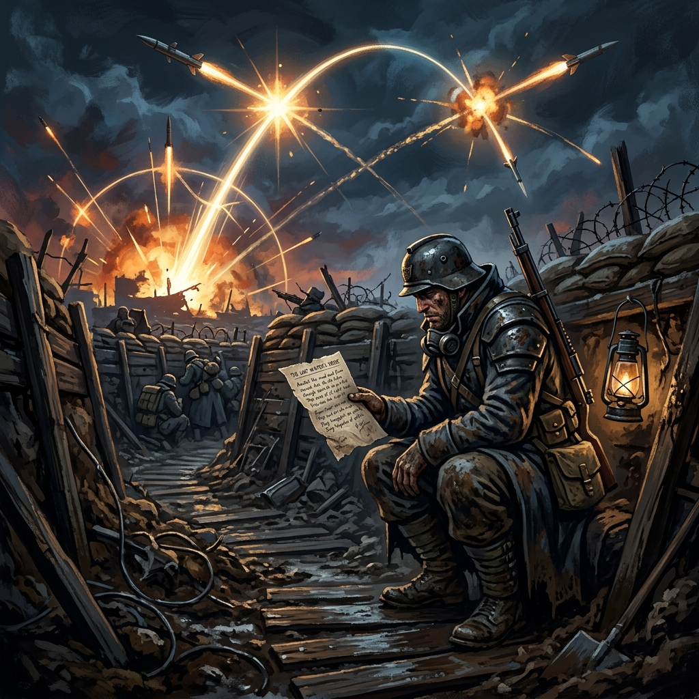
<!-- slide -->
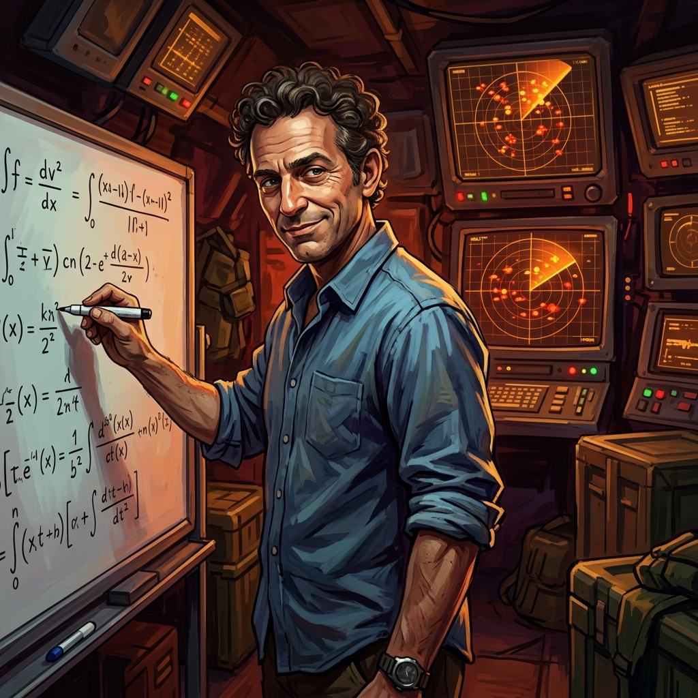
<!-- slide -->
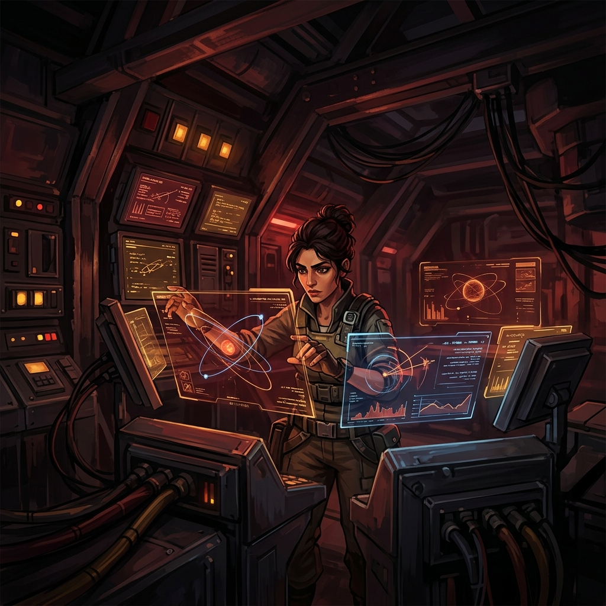
````

埃坦・沙哈(S-07)與蕾拉・侯賽尼(T-10)的演算法軍備競賽白熱化:
攔截率在 58% 與 91% 之間鋸齒震盪,雙方每週互相迭代。
兩人在彈道參數裡夾帶的「論文式攻防注記」被兩邊情報部門當成密碼分析了半年——
其實只是數學家之間的禮貌:「此解甚美,惜邊界條件未盡。」

**哀悼詩外流**:法拉赫扎德教授(T-09)寫給敵我雙方陣亡操作員的無署名詩集被截獲,
一週內在兩軍戰壕傳抄。協約政治部下令追查作者;負責追查的軍官抄了一份,留著。

**傭兵市場黃金期**:「雪線」林德特(N-03)的午夜結算一席難求;
「界碑」里奧斯(N-07)的隊同月接下兩陣營的要地保全單,條款內零違約、傷員零拋棄;
「尾聲」拉托爾(N-08)完成了那筆傳說中的單:一發子彈,協約王牌保住了命,同盟雷達站保住了天線——
至今沒人知道雇主是哪一邊,而尾款一入帳,她照例查無此人。

**蜂群視角(埃坦・沙哈)**:攔截率鋸齒震盪的那幾個月,他把每一次下降都當成教材寫下——「敗給對面的人,是進步最快的方式。」他從沒見過蕾拉・侯賽尼的臉,卻能從她的突防軌跡裡讀出對方是個怎樣的人:謹慎、精確,永遠留一手。「這種對手,值得認真輸給她。」

**鋼鐵視角(達留什・法拉赫扎德)**:哀悼詩集被截獲那天,他其實鬆了一口氣——寫了這麼多年,終於有人讀到了。他猜不到會有軍官抄一份留下,但若猜到了,他大概會覺得這就是詩本來該有的下場:活過原本被指派的用途。

**第三方視角(約蘭妲・里奧斯)**:「尾聲」完成那筆傳說中的單子時,她的隊正好在附近守著另一片天空。後來聽說了那發子彈的事,她只淡淡說了一句:「這行做久了,你會發現最厲害的合約,都是雇主自己也說不清到底買到了什麼。」

---

## 終幕:信使日(2031 春)

````carousel
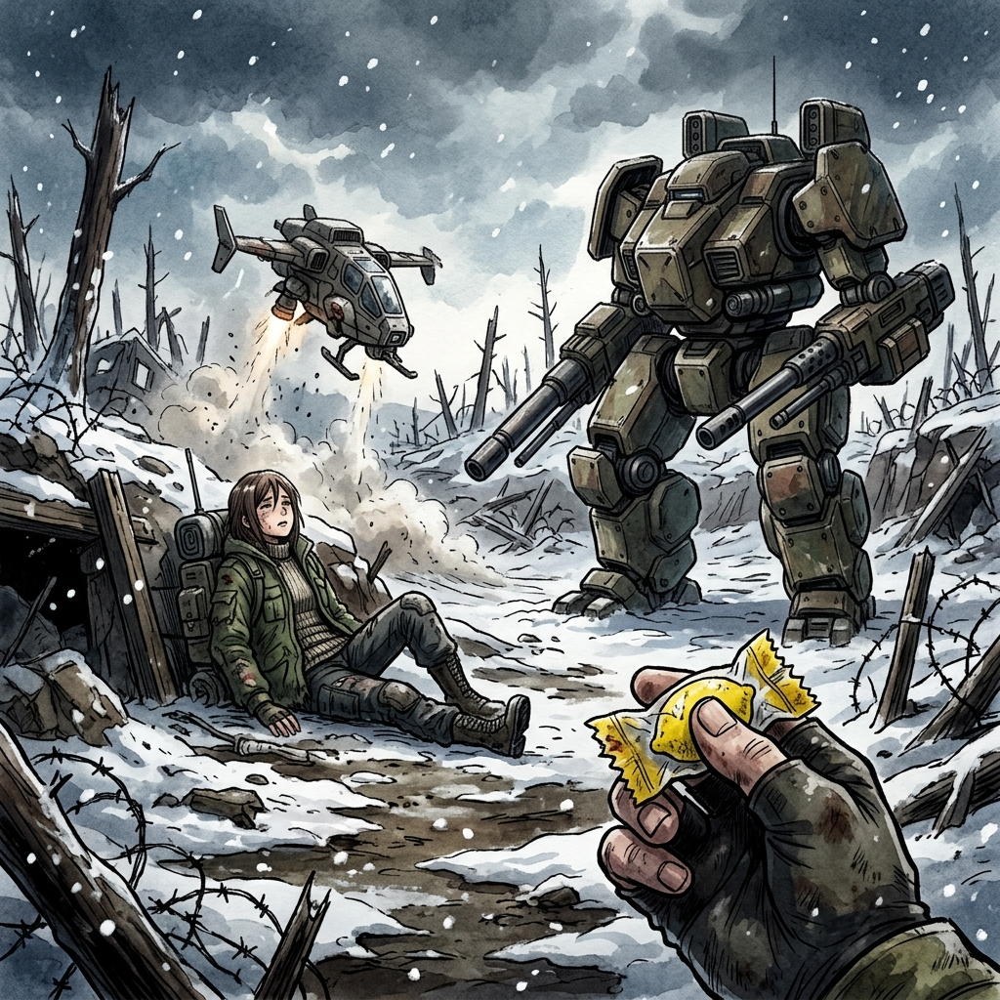
<!-- slide -->
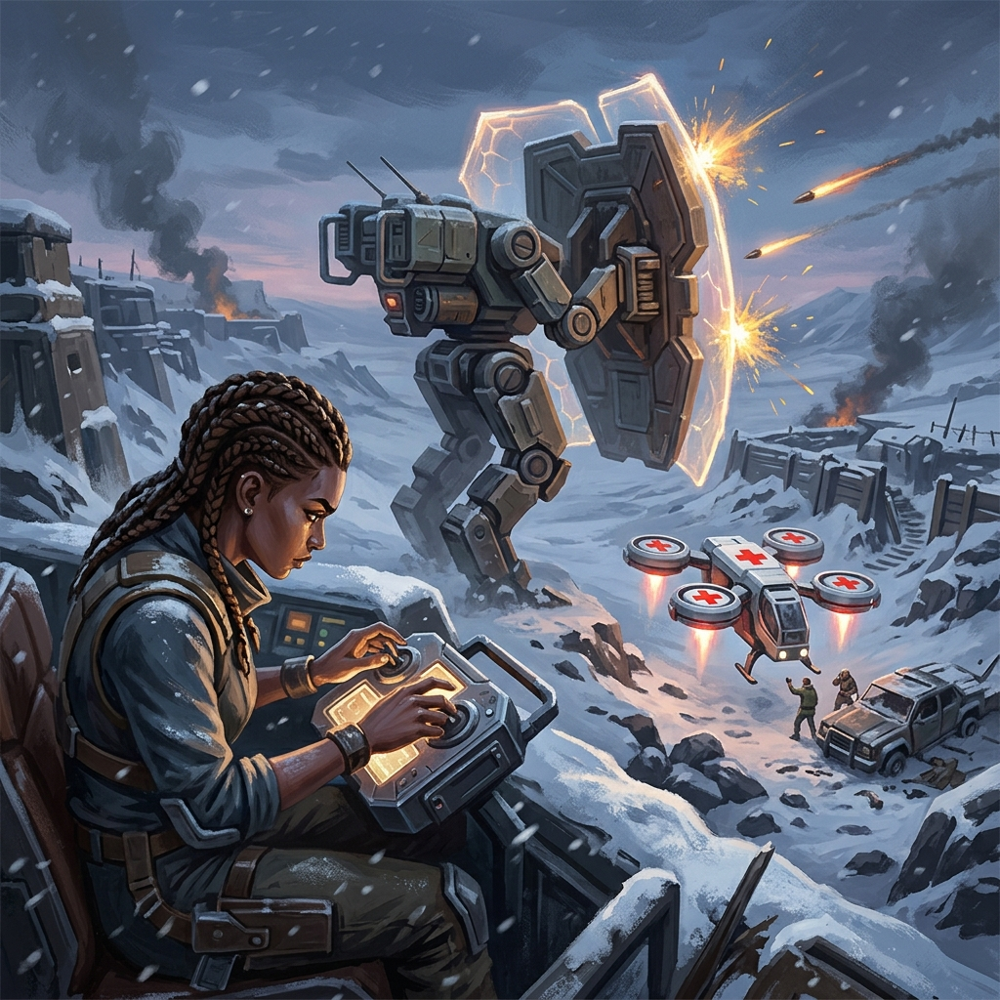
<!-- slide -->
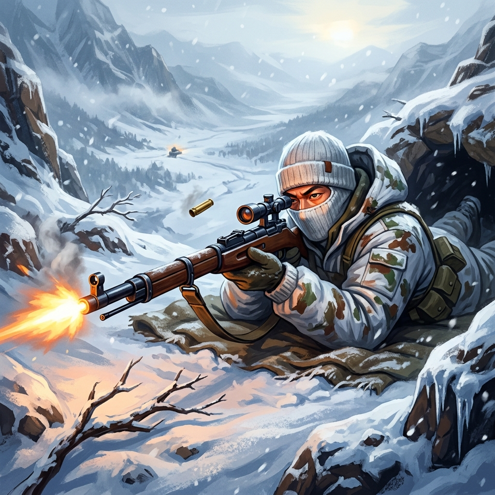
````

協約在北線試驗部署新型自主火控「**哨兵-9**」——交戰迴路裡沒有人,只有模型。

清晨 05:47,哨兵-9 將米菈的背包機隊誤判為蜂群滲透編隊,開火。
米菈重傷,墜落在無人地帶。**「不打信使」——全戰場最後一條默契,被一台機器打破了。**

接下來的六分鐘,戰史稱為「六分鐘的和平」:

- **05:48** 李正赫(T-07)抗命離開狙擊位,兩發擊毀持續追擊的自主機。他清楚這兩發的代價。
- **05:50** 瑪雅・柯爾曼(S-06)違反自己合約裡的每一條,起飛,用機體替擔架空投遮擋彈道。
- **05:51** 佐菲亞(S-08)的醫療機隊直入交戰空域,僚機頻道裡她的聲音換了一個人。
- **05:52** 薇拉(T-02)在全線共用頻道唸出一組無人聽懂的暗語——半張檸檬糖紙的編號。然後說:「她欠我半張。停火。」
- **05:53** 蜂后與冬將軍的頻道第一次直接接通。
  「格羅莫夫上將,你的機器打了信使。」
  「……薛甫琴科中校,給我三十分鐘。」
- **06:17** 格羅莫夫親自下令全線關閉哨兵-9,提前十三分鐘。

24 小時「信使停火」裡,兩軍的軍醫在無人地帶同一頂帳篷裡工作。
米菈活了下來,左腿換成義肢;三個月後她重返路線,背包上多了兩枚新徽章——
兩大陣營的最高榮譽,史上第一次別在同一顆背包上。

停火最後一小時,雙方簽署了戰爭史上唯一的共同技術條約《**信使協定**》:
**任何交戰迴路必須有人類在環。**條文最末句由法拉赫扎德起草:

> 「扣下扳機的,必須是一個會於心不安的東西。」

戰爭沒有結束。但從這一天起,天上每一台機器背後都坐著一個人——
**這就是你們每一場對戰的由來。**

**蜂群視角(瑪雅・柯爾曼)**:違反合約條款起飛的那六分鐘,她想的不是懲罰,是日誌本上那道還沒畫下去的橫線——這一次,她要親手替米菈畫上。事後她把那頁日誌撕了下來,不是因為後悔,是因為那一頁不該再屬於「攔截記錄」,該屬於別的東西。

**鋼鐵視角(李正赫)**:抗命離開狙擊位的那一刻,他想起的是妹妹最後一封信裡的一句話:「哥,你打的都是機器吧?」他從沒回答過這個問題。那兩發子彈,是他第一次,也可能是唯一一次,替自己選了答案。

**第三方視角(米菈)**:重傷倒地的那幾分鐘裡,她唯一記得的是背包還在不在——裡面有三封沒送到的信。三個月後她重返路線,背包上多了兩枚新徽章;她私下跟邦達爾說,其實她更想要的獎勵,是背包能再大一點,這樣就能一次多帶幾封信。

---

## 尾聲:懸而未決(續作鉤子)

- **灰雁的名單**劃掉了一行,添上了一行:哨兵-9 背後推動「無人在環」的軍工說客集團。她開始在體制內狩獵體制。
- **阿列霞的日誌**在政治部抽查前夜消失了。是她自己燒的,還是有人替她收走的?她與 Staatika 的圍棋每週照下,最近一局她第一次執黑先行。
- **薇拉的條令手冊**裡,糖紙之間多了一頁手抄樂譜——蜂后總譜的一個樂句。沒人知道她想在哪裡彈給誰聽。
- **林德特的皮面小冊**多了一行沒有金額的紀錄,備註欄只寫一個詞:「Messenger」。她說那筆帳要等一個合適的場合結,沒說是哪一年的場合。
- **李正赫的兩發**:抗命紀錄被某位「追查哀悼詩的軍官」壓進了不存在的檔案夾。彈殼裡的灰燼,如今是三封信的量。

---

## 戰役地圖對照(21 預設場地 → 戰史事件)

遊戲每個預設場地對應主線裡的一場著名交鋒(載入畫面可各配一行戰史句)。示例:

| 場地 | 戰史名 | 一行戰史 |
|---|---|---|
| 德國・黑森林 | 首次王牌對決(第一幕) | 41 機換一個彈藥耗盡,兩本筆記各多一頁 |
| 台北・101 信義計畫區 | 產線之夜(第二幕) | 她抱著晶圓進掩體;兩年後,她自己也上了天 |
| 首爾・江南 | 搖籃曲事件(第二幕) | 22 副耳機聽見同一首歌,整條兵線靜了一夜 |
| 京都・嵐山竹林寺町 | 二重唱・東亞回合 | 竹林裡的頻譜戰,參謀聽不懂,只能看勝負 |
| 淡水河口・紅樹林濕地 | 斷膝戰術首演(第三幕) | 機甲在灘地學會了害怕自己的膝蓋 |
| 威尼斯・潟湖水都 | 信使日(終幕) | 六分鐘的和平,從一台機器的誤判開始 |
| 開羅・吉薩金字塔群 | 尾聲的一發(第四幕) | 一發子彈,兩邊都說自己贏了 |
| 波札那・奧卡萬戈三角洲 | 霧行者的搜索(支線) | 她找到了墜機,也替它拍了遺照 |
| 智利・阿塔卡馬月亮谷 | 加拉泰亞試驗場(第一幕) | 七個孩子進去,結案報告剩一個名字 |
| 澳洲・烏魯魯巨岩 | 獵場主的天空(支線) | 那裡的雷達一片乾淨,獵場主的眼睛不是 |
| 克里米亞・塞瓦斯托波爾 | 終樂章(終幕) | 繞了地球一大圈,兩面鏡子在起點正面相對 |

其餘場地(澀谷、曼哈頓、巴黎、陽明山、青木原、優勝美地、合歡山、伊瓜蘇、里約、雪梨、倫敦)
依同格式由場地檔補完,原則:**市區場地配電戰/巷戰事件,綠地配獵殺/偵察事件,裸露地配試驗場/狙擊事件,水體濕地配運補/人道事件。**

---

## 開場互動語音(遊戲內 banter 範例,節選)

同場對戰的英雄組合在載入完成時觸發一組對白(僅需文字,不需配音即可上線):

**蜂后 vs 冬將軍(敵對)**
- 蜂后:「上將,你的三十分鐘,我一直記著。」
- 冬將軍:「中校,所以今天別打信使,其他照舊。」

**灰雁 vs 蜂后(敵對)**
- 灰雁:「名單上見,蜂后。」
- 蜂后:「你每次都這麼說,我的總譜都替你留了休止符。」

**薇拉 vs 蜂后(敵對)**
- 薇拉:「今天,彈你的第四樂章。」
- 蜂后:「……孩子,那一章我還沒寫完。」

**林翎 vs 河瑟琪(同隊)**
- 河瑟琪:「晶片今天別當機喔,天才。」
- 林翎:「當機的從來是你的操作,王牌。」

**卡佳 vs 韓雪(敵對)**
- 韓雪:(頻道裡輕輕哼了一小節)
- 卡佳:(打字)「這段我上週就反制了。重唱。」

**鐵證 vs 落點(敵對)**
- 沙哈:「今天的邊界條件,補全了。」
- 侯賽尼:「拜讀。我的反例在第三波。」
- (兩人的呼號本身就是一句對白:軌跡的證明,與軌跡的終點。)

**樫村 vs 陸小川(敵對)**
- 樫村:「新人,遙控器沒電的時候怎麼辦?」
- 陸小川:「跑!呃不對——鐵鍬!」

**富恩特斯 vs 格羅莫夫(同隊)**
- 富恩特斯:「老地方薄,瓦列里。」
- 格羅莫夫:「所以我把它加厚了,拉斐爾。」

**惠特洛克 vs 雪線(任意)**
- 雪線:「牧場主,續保還是老方案?老朋友打九五折。」
- 惠特洛克:「上次的九五折,發票開給了對面。」

**米菈(中立登場,任意陣營)**
- 米菈:「先說好——打完記得收信。兩邊的,都有。」

**李正赫 vs 瑪雅(敵對)**
- (無對白。兩機在頻道裡各自靜默兩秒——那天在場的人都懂。)

**嘉年華 vs 河瑟琪(敵對)**
- 嘉年華:「聽說你是擊墜王?跟上我再說!」
- 河瑟琪:「跟上你?我在你前面等你。」

**林翎 vs 賽伊托夫(同隊)**
- 賽伊托夫:「機體交給妳了。它落地是用走的,別忘了。」
- 林翎:「我知道。牠一半是爪,一半是羽——跟我一樣還沒被歸類完。」

---

## 補充:陣營內部張力(對戰外的敘事面)

- **蜂群不是聖人**:同盟內部對「神風玩法」有路線之爭——瑪雅公開反對把自爆寫進標準戰術,
  河瑟琪則認為「機器替人去死正是我們的全部道理」;蜂后夾在中間,總譜裡永遠留著兩種寫法。
- **鋼鐵不是惡人**:協約內部,沈鶴鳴的「品質派」與量產派的鬥爭從未停止;
  格羅莫夫護著她——不是因為喜歡她,而是因為墳墓教過他偷工的代價。
- **傭兵不是局外人**:《信使協定》簽署那天,林德特罕見地免了當月所有合約的佣金。
  有人問為什麼,他說:「市場也需要體面。」——沒人見過他那天晚上在酒窖裡待了多久。
